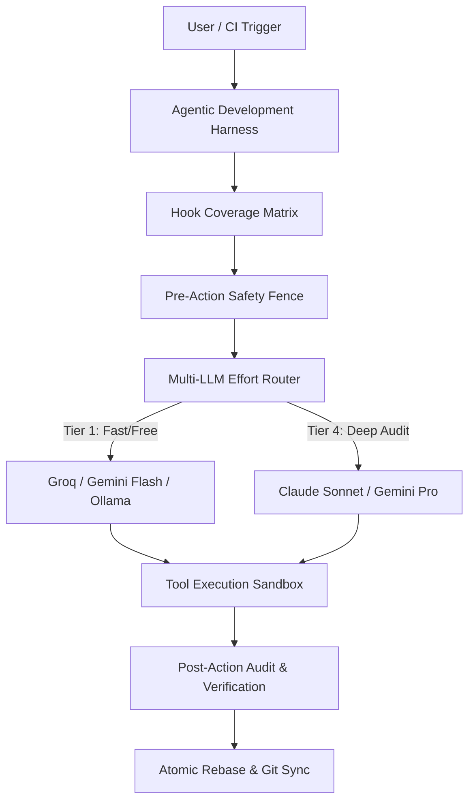

# Agentic Development Harness Architecture

> **Canonical Knowledge Document**: `05_KNOWLEDGE/agentic-development-harness-architecture.md`  
> **Source Synthesis**: Extracted from empirical architectures including `modu-ai/moai-adk`, `OrchestratorInc/agent-orchestrator`, and `tiger-ai-lab/TheoremExplainAgent`.  
> **Topic**: Production-Grade Agentic Harnesses, Lifecycle Interceptors, and Multi-LLM Routing.

---

## 1. Executive Architecture

Modern autonomous coding agents require a resilient runtime harness between the raw LLM API and the underlying host operating system. Without a structured harness, agents suffer from:
1. **Loop Blindness**: Running in endless error loops without detecting repeating states.
2. **Zombie Interceptors**: Assuming security, budget, or audit hooks are active when handlers are missing.
3. **Budget Runaway**: Burning frontier reasoning models on trivial syntax formatting.

---

## 2. The 5 Core Invariants of Agentic Harnesses

### Invariant 1: Self-Diagnosing Hook Coverage Table
Lifecycle hooks (`pre-action`, `post-action`, `tool-call`, `cost-fence`) must be registered in a canonical Coverage Table with explicit resolution states (`KEEP`, `UPGRADE`, `FIX`, `RETIRE_OBS_ONLY`, `REMOVE`, `COMPOSITE`). Built-in diagnostics (`doctor --hooks`) verify handler files on disk before executing actions.

### Invariant 2: Tiered Effort & Token Envelopes
Task complexity determines model selection. Low-complexity tasks (AST inspection, formatting, test boilerplate) are routed to fast, zero-cost models. High-complexity tasks (architecture restructuring, concurrency audits) are routed to frontier reasoning models.

### Invariant 3: Single-Binary / Zero-Dependency Runtime
Harnesses deployed in developer environments or CI/CD should minimize heavy external dependencies. Prefer compiled single binaries (Go/Rust) or native Node stdlib scripts over multi-gigabyte package trees.

### Invariant 4: Monotonic Failure Incident Ledger
Every failure, timeout, or schema mismatch must be logged to a persistent incident ledger with error code, stack trace, and resolution state. The agent harness inspects the ledger before retry to prevent repeating known failure modes.

### Invariant 5: Concurrency Safety & Mutex Locks
When multiple agents run in parallel (such as domain-partitioned fleet workers), file and git modifications must be guarded by target-level advisory locks and atomic rebase-and-retry push loops.
