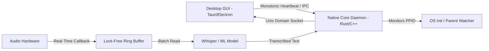

# High-Performance Desktop IPC & Real-Time Audio Streaming Architecture

> **Canonical Knowledge Document**: `05_KNOWLEDGE/high-performance-desktop-ipc-and-audio.md`  
> **Source Synthesis**: Extracted from empirical architectures including `typewhisper/typewhisper-mac` and `wzh4869/appports`.  
> **Topic**: Low-Latency Localhost IPC, Parent-Child Process Reaping, and Real-Time Audio Ring Buffers.

---

## 1. Executive Summary

Desktop applications integrating machine learning models (such as local Whisper STT, TTS, or audio filters) face severe architectural challenges:
1. UI frameworks (Electron, Tauri, React Native Desktop) run in garbage-collected environments that cannot guarantee real-time audio thread timing.
2. Native daemon processes spawned as background helpers can become orphaned zombies if the GUI crashes, holding open hardware microphones, GPU memory, and network ports.

---

## 2. Core Architectural Principles

### 1. Lock-Free Audio Ring Buffers
OS audio hardware callbacks (e.g. CoreAudio, ALSA, WASAPI) run with high thread priority. Performing dynamic memory allocation (`malloc`, `new`, `std::vector::resize`) inside these callbacks causes Priority Inversion and audible buffer underruns (glitches/pops).
- Audio samples MUST be pushed into a fixed-capacity circular ring buffer using atomic head/tail indices.
- If consumer lags, drop oldest frames rather than expanding buffer on the audio thread.

### 2. Parent-Death Watchdog & Zombie Reaper
Native daemons launched as child processes must continuously verify the lifecycle of the parent process:
- On Unix/macOS: Check `libc::getppid()`. If parent dies, the child process is adopted by `launchd`/`init` (PID 1). If `getppid() == 1`, immediately self-terminate (`process::exit(0)`).
- On Windows: Attach job objects with `JOB_OBJECT_LIMIT_KILL_ON_JOB_CLOSE` so that child processes terminate automatically when the parent process handle closes.

### 3. Unix Domain Socket RPC vs HTTP
For inter-process communication on localhost:
- Prefer Unix Domain Sockets (`.sock`) or Named Pipes over TCP loopback (`127.0.0.1:port`).
- Sockets bypass network stack overhead, provide filesystem-permission based security, and avoid port conflict collisions.
