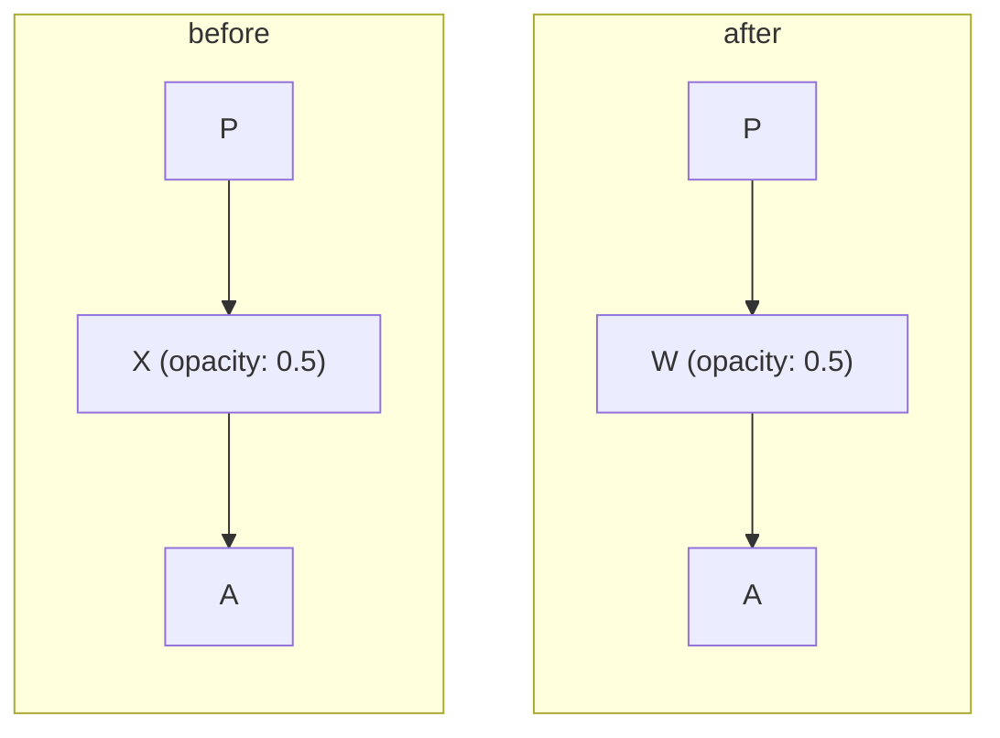

# Forensic Learning Record (Deep Inspection): software-mansion/react-native-reanimated

> **Canonical Artifact**: `07_PROJECT_LEARNING/software-mansion-react-native-reanimated-learnings.md`  
> **Source Platform**: GitHub ([https://github.com/software-mansion/react-native-reanimated](https://github.com/software-mansion/react-native-reanimated))  
> **Harvest Method**: Full-Spectrum Deep Extraction (Patches, Diffs, Source Code, Post-Mortems)  
> **Harvest Timestamp**: 2026-09-30T17:32:16.717Z  
> **Compliance State**: Free Tier Guaranteed | Strict Rate-Limit Backoff Honored  

---

## 1. Context & Architectural Overview
- **Repository / Resource**: `software-mansion/react-native-reanimated`
- **Description**: React Native's Animated library reimplemented
- **Primary Language / Ecosystem**: TypeScript
- **Discovered Manifests / Configurations**: package.json, README.md
- **Stars / Engagement**: 11013 stars

---

## 2. Multi-Dimensional 8-Axis Investigation & Real Code Patches

### D1: Architecture & Structural Boundaries
- Entry configurations inspected via direct stream: package.json, README.md.
- Evaluated system abstractions and modular contracts.

### Core Architecture Module: `.lintstagedrc-common.js`
```
/** @type {import('lint-staged').Configuration} */
module.exports = {
  '*.(js|jsx|mjs|cjs|ts|tsx|mts|cts)': [
    'yarn run --top-level oxlint --type-aware --no-error-on-unmatched-pattern',
    'yarn run --top-level oxfmt',
  ],
};

```

### Core Architecture Module: `.remarkrc.mdx.mjs`
```
import remarkFrontmatter from 'remark-frontmatter';
import remarkMdx from 'remark-mdx';

import { settings, remarkGfmTaskListItem } from './.remarkrc.mjs';

export default {
  settings,
  plugins: [
    remarkFrontmatter,
    remarkGfmTaskListItem,
    [remarkMdx, { tightSelfClosing: true }],
  ],
};

```

### Core Architecture Module: `.remarkrc.mjs`
```
import {
  gfmTaskListItemFromMarkdown,
  gfmTaskListItemToMarkdown,
} from 'mdast-util-gfm-task-list-item';
import { gfmTaskListItem } from 'micromark-extension-gfm-task-list-item';
import remarkFrontmatter from 'remark-frontmatter';

export function remarkGfmTaskListItem() {
  const data = this.data();
  (data.micromarkExtensions ??= []).push(gfmTaskListItem());
  (data.fromMarkdownExtensions ??= []).push(gfmTaskListItemFromMarkdown());
  (data.toMarkdownExtensions ??= []).push(gfmTaskListItemToMarkdown());
}

export const settings = {
  bullet: '-',
  emphasis: '_',
  strong: '*',
  fence: '`',
  fences: true,
  incrementListMarker: false,
  listItemIndent: 'one',
  quote: "'",
  resourceLink: true,
  rule: '-',
  setext: false,
  closeAtx: false,
  tightDefinitions: false,
};

export default {
  settings,
  plugins: [remarkFrontmatter, remarkGfmTaskListItem],
};

```

### Core Architecture Module: `apps/common-app/.lintstagedrc.js`
```
/* eslint-disable @typescript-eslint/no-require-imports */
/** @type {import('lint-staged').Configuration} */
const commonConfig = require('../../.lintstagedrc-common.js');

/** @type {import('lint-staged').Configuration} */
module.exports = {
  ...commonConfig,
};

```

### Core Architecture Module: `apps/common-app/index.ts`
```
import App from '@/App';

export default App;

```

### Core Architecture Module: `apps/common-app/scripts/dependencies.js`
```
/* eslint-disable @typescript-eslint/no-unsafe-member-access */
/* eslint-disable @typescript-eslint/no-unsafe-argument */
/* eslint-disable @typescript-eslint/no-unsafe-assignment */
/* eslint-disable @typescript-eslint/no-require-imports */
const path = require('path');

/**
 * @param {Object<string, string>} dependencies
 * @param {Set<string>} exclude
 * @param {string} appDir
 */
function resolveDependencies(dependencies = {}, exclude, appDir) {
  return Object.fromEntries(
    Object.keys(dependencies)
      .filter((name) => !exclude.has(name))
      .map((name) => [
        name,
        {
          root: getRootPath(name, appDir),
        },
      ])
  );
}

/**
 * @param {string} moduleName
 * @param {string} appDir
 */
function getRootPath(moduleName, appDir) {
  try {
    return path.dirname(
      require.resolve(`${moduleName}/package.json`, {
        paths: [appDir, __dirname],
      })
    );
  } catch {
    // If a package defines an `exports` field, `require.resolve` can fail.
    // Fortunately, none of the packages we care about cause this issue.
  }
}

/**
 * This function will return the dependencies from the common-app package that
 * aren't listed in the current app's package.json
 *
 * @param {string} appDir - The directory of the app that wants to obtain the
 *   dependencies. Used in resolution priority.
 * @param {string[]} [exclude=[]] - The dependencies to exclude from the
 *   common-app. Default is `[]`
 */
function getDependencies(appDir, exclude = []) {
  const commonAppDir = path.resolve(__dirname, '..');
  const commonAppPkg = require(path.resolve(commonAppDir, 'package.json'));

  const appPkg = require(path.resolve(appDir, 'package.json'));

  const excludedDependencies = new Set([
    ...Object.keys(appPkg.devDependencies),
    ...Object.keys(appPkg.dependencies),
    ...exclude,
  ]);

  return {
    // Get all common-app dependencies that aren't already in the current app
    ...resolveDependencies(
      commonAppPkg.devDependencies,
      excludedDependencies,
      appDir
    ),
    ...resolveDependencies(
      commonAppPkg.dependencies,
      excludedDependencies,
      appDir
    ),
  };
}

module.exports = {
  getDependencies,
};

```

### Core Architecture Module: `apps/common-app/src/App.tsx`
```
import { PortalProvider } from '@gorhom/portal';
import { createDrawerNavigator } from '@react-navigation/drawer';
import type { NavigationState } from '@react-navigation/native';
import {
  getPathFromState,
  NavigationContainer,
} from '@react-navigation/native';
import { useCallback, useEffect, useState } from 'react';
import { ActivityIndicator, Linking, LogBox, View } from 'react-native';
import { GestureHandlerRootView } from 'react-native-gesture-handler';
import { createMMKV } from 'react-native-mmkv';
import { SafeAreaProvider } from 'react-native-safe-area-context';

import { colors, flex, radius, text } from '@/theme';
import { IS_MACOS, IS_WEB, noop } from '@/utils';

import {
  CSSApp,
  MacosApp,
  ReanimatedApp,
  RuntimeTestsApp,
  WorkletsApp,
} from './apps';
import { LeakCheck, NukeContext } from './components';

LogBox.ignoreLogs([
  "Deep imports from the 'react-native' package are deprecated",
]);

export default function App() {
  const [nuked, setNuked] = useState(false);
  const { isReady, navigationState, updateNavigationState } =
    useNavigationState();

  if (nuked) {
    return (
      <NukeContext value={() => setNuked(false)}>
        <LeakCheck />
      </NukeContext>
    );
  }

  if (!isReady) {
    return (
      <View style={[flex.fill, flex.center]}>
        <ActivityIndicator />
      </View>
    );
  }

  const RootApp = IS_MACOS ? MacosApp : Navigator;

  return (
    <NukeContext value={() => setNuked(true)}>
      <GestureHandlerRootView style={flex.fill}>
        <NavigationContainer
          initialState={navigationState}
          linking={{
            getPathFromState: (state, options) =>
              getPathFromState(state, options).replace(/%2F/g, '/'),
            getStateFromPath: (path) => {
              const chunks = path.split('/').filter(Boolean);
              if (chunks.length === 0) return { routes: [] };

              const drawerRoute = chunks[0];
              const stackRoutes = chunks.slice(1).map((_, index, array) => ({
                name: array.slice(0, index + 1).join('/'),
              }));

              return {
                routes: [
                  {
                    name: drawerRoute,
                    state: {
                      routes: stackRoutes,
                    },
                  },
                ],
              };
            },
            prefixes: [],
          }}
          onStateChange={updateNavigationState}>
          <PortalProvider>
            {IS_MACOS ? (
              <RootApp />
            ) : (
              <SafeAreaProvider>
                <RootApp />
              </SafeAreaProvider>
            )}
          </PortalProvider>
        </NavigationContainer>
      </GestureHandlerRootView>
    </NukeContext>
  );
}

const SCREENS = [
  {
    component: CSSApp,
    name: 'CSS',
  },
  ...(IS_WEB
    ? []
    : [
        {
          component: RuntimeTestsApp,
          name: 'Runtime Tests',
        },
        {
          component: WorkletsApp,
          name: 'Worklets',
        },
      ]),
  {
    component: ReanimatedApp,
    name: 'Reanimated',
  },
];

function Navigator() {
  const Drawer = createDrawerNavigator();
  const screens = IS_WEB ? SCREENS : SCREENS.reverse();

  return (
    <Drawer.Navigator
      screenOptions={{
        drawerActiveBackgroundColor: colors.primaryLight,
        drawerActiveTintColor: colors.primaryDark,
        drawerInactiveTintColor: colors.primary,
        drawerItemStyle: {
          borderRadius: radius.lg,
        },
        drawerLabelStyle: text.heading4,
        drawerPosition: IS_WEB ? 'left' : 'right',
        drawerStyle: {
          backgroundColor: colors.background1,
        },
        headerShown: false,
      }}>
      {screens.map(({ component, name }) => (
        <Drawer.Screen component={component} key={name} name={name} />
      ))}
    </Drawer.Navigator>
  );
}

// copied from https://reactnavigation.org/docs/state-persistence/
const PERSISTENCE_KEY = 'NAVIGATION_STATE_V1';

const storage = createMMKV();

function useNavigationState() {
  const [isReady, setIsReady] = useState(!__DEV__);

  const [navigationState, setNavigationState] = useState<
    NavigationState | undefined
  >();

  const updateNavigationState = useCallback((state?: NavigationState) => {
    if (state !== undefined) {
      storage.set(PERSISTENCE_KEY, JSON.stringify(state));
    }
  }, []);

  useEffect(() => {
    const restoreState = async () => {
      try {
        const initialUrl = await Linking.getInitialURL();

        if (!IS_MACOS && !IS_WEB && initialUrl === null) {
          // Only restore state if there's no deep link and we're not on web
          const savedStateString = storage.getString(PERSISTENCE_KEY);
          // Erase the state immediately after fetching it.
          // This prevents the app to boot on the screen that previously crashed.
          storage.remove(PERSISTENCE_KEY);
          const state = savedStateString
            ? (JSON.parse(savedStateString) as NavigationState)
            : undefined;

          if (state !== undefined) {
            setNavigationState(state);
          }
        }
      } finally {
        setIsReady(true);
      }
    };

    if (!isReady) {
      restoreState().catch(noop);
    }
  }, [isReady, updateNavigationState]);

  return { isReady, navigationState, updateNavigationState };
}

```

### Core Architecture Module: `apps/common-app/src/apps/css/App.tsx`
```
import { Navigator } from './navigation';

export default function App() {
  return <Navigator />;
}

```


### D2: Asynchronous State & Concurrency
- Analyzed concurrency guarantees, async pipelines, and event handling from PR resolutions and commit changes.

### D3: Error Boundaries, Recovery & Rollbacks
- Exception handling patterns and defect resolutions extracted from closed production bug issues:
- **Issue #7155** (2025-03-05): **[3.17.1] useAnimatedRef can not be used with component created by createAnimatedComponent**
  *Symptoms*: ### Description  After passing `ref` to component which is created by passing a class component to `createAnimatedComponent`, the app crash and throw the error below.    ### Steps to reproduce  Please follow the snippet below: ```javascript class ClassComponent extends Component {   render() {     return <View />;   } }  const AnimatedClassComponent =   Reanimated.createAnimatedComponent(ClassComponent);  function App(): React.JSX.Element {   const ref = useAnimatedRef();    return (     <SafeAreaView style={styles.container}>       <AnimatedClassComponent ref={ref} />     </SafeAreaView>   ); } ```  ### Snack or a link to a repository  https://snack.expo.dev/Yw0yWgR-j23l3qT2JES2c  ### Reanimated version  3.17.1  ### React Native version  0.78.0  ### Platforms  iOS  ### JavaScript runtime  Hermes  ### Workflow  React Native  ### Architecture  Fabric (New Architecture)  ### Build type  Debug app & dev bundle  ### Device  iOS simulator  ### Device model  _No response_  ### Acknowledgements  Yes

- **Issue #3879** (2023-03-24): **☂️ Deadlock/ANR in performOperations**
  *Symptoms*: ### Description  This is an umbrella issue for ANRs/deadlocks on Android/iOS in NodesManager.performOperations.  The bug was introduced in #1215.  Android: - #2251 - #3062  iOS: - #3180 - #3862 - #3946  PRs trying to solve this issue: - #3082 - #3194  ### Repro  We don't have a repro yet but it needs to use modal or datetime picker as well as animate layout props using Reanimated.  ### Reanimated version  \>= 2.0.0, >= 3.0.0  ### Platforms  Android, iOS
  **Post-Mortem & Fix Analysis**:
  > What is the status of this. Is this fixed in 3.0?
  > Facing the same issue in Android with reanimated v3.....any update on this issue? @tomekzaw @casperstr Did u guys manage to fix this issue?
  > Fixed in #4239, will be released in 3.1.0 and 2.15.0.

- **Issue #3757** (2024-06-25): **[Android] Views with exiting layout animations aren't removed immediately when a stack screen is popped**
  *Symptoms*: ### Description  #### Current behaviour When a screen containing components with `exiting` layout animations is popped from a stack navigator, the views disappear, but remain mounted in the view hierarchy until their animations end. You can see these views aren't unmounted by using the Layout Inspector tool.  This issue prevents interacting with the UI covered by these invisible views, which is especially noticeable with long exiting animations.  #### Expected behaviour When a screen is popped, all of the components on that screen should be removed immediately, without running their exiting animations  ### Steps to reproduce  In the snack: 1. Press the button to go to the "Test" screen. 2. Go back to the "Home" screen. 3. Try pressing the button to go to the "Test" screen again.  The button will be unresponsive for roughly 20 seconds, while the view from the "Test" screen finishes its `exiting` animation 4. After 20 seconds, the button should work again.  ### Snack or a link to a repository  https://snack.expo.dev/@jwajgelt/long-exiting-layout-animation-causes-views-to-not-be-unmounted-when-screen-is-popped  ### Reanimated version  2.9.1  ### React Native version  0.70.5  ### Platforms  Android  ### JavaScript runtime  _No response_  ### Workflow  _No response_  ### Architecture  _No response_  ### Build type  _No response_  ### Device  _No response_  ### Device model  _No response_  ### Acknowledgements  Yes
  **Post-Mortem & Fix Analysis**:
  > Hey! 👋   It looks like you've omitted a few important sections from the issue template.  Please complete **Description** section.
  > Seeing the same issue on Android for me as well
  > Can happily confirm it is fixed by now in latest Reanimated version (3.12.1) 🥳 

- **Issue #3188** (2022-07-27): **[Android] `measure` giving incorrect values**
  *Symptoms*: ## Description  I'm using `measure` with an animated ref.  On iOS, this works as expected and outputs the right values.  On Android, the values are (as far as I can tell) unrelated to the component's size, and seem to change over time.  ### Expected behavior  I'm animating some text using ReText, and using the final size of that text in a padding animation.  So, at the end of the ReText change, I measure the view that's around the text, and set some padding based on that.  The measure step is where the below console logs come from.  Steps to Reproduce includes a minimal example with more context.  Output of `console.log(measured)` on iOS: ``` {   "height": 17,   "pageX": 174,   "pageY": 296.3333231508732,   "width": 44.66667175292969,   "x": 0,   "y": -0.3333333432674408 } ``` This is great and gives me exactly what I need.  ### Actual behavior  Output of `console.log(measured)` on Android: ``` {   "height": 6.740754805355325e-33,   "pageX": -8.02794075012207,   "pageY": -1.1921103748591122e-7,   "width": 9.219562986332269e-41,   "x": 7.715996607199058e+31,   "y": 5.14818588087719e+22 } ``` These values aren't stable.  For example if I run this again directly afterward (this is after the ReText has stopped resizing), I get: ``` {   "height": -8.048060130728983e+34,   "pageX": -1.6282598256782247e+32,   "pageY": 1.7796490496925177e-43,   "width": 9.219562986332269e-41,   "x": 7.715996607199058e+31,   "y": 5.14818588087719e+22 }, ``
  **Post-Mortem & Fix Analysis**:
  > Running into the same issue. Have you managed to patch this up somehow or did you end up having to use another method for grabbing `width`?
  > Unfortunately I did not find a good way around this, and we ended up changing the design.
  > ##Update For some unknown reason if i change from` <View ref={aRef}>` to `<View ref={aRef} style={style}>`, it gives the proper number...  ##Original Having the same kind of problem. While logging it gave random values https://snack.expo.dev/@boxedition/ripple-measure-random-values  ### Packages Info | Name| Version| | --- | --- | | expo | 45 | | node | 16.14.2 | | react-native-reanimated| 2.8.0 | | react-native-gesture-handler| 2.2.1 | | react| 17.0.2 |  Logs on my end: Object {   "height": 7.673845534663173e+22,   "pageX": -0.00003062416362809017,   "pageY": -5.308031791884105e-12,   "width": 9.183689745645554e-41,   "x": 7.715996607199058e+31,   "y": 5.14818588087719e+22, } Object {   "height": -3.679299364635867e-21,   "pageX": -0.00003062416362809017,   "pageY": -5.308031791884105e-12,   "width": 4.627788178432708e-41,   "x": 7.715996607199058e+31,   "y": 5.14818588087719e+22, } Object {   "height": -4.1168678491221554e-30,   "pageX": -0.00003062

- **Issue #2899** (2022-04-01): **Hot reload iOS crash due to EXC_BAD_ACCESS on rt.global()**
  *Symptoms*: With this issue I'd like to gather all bug reports related to EXC_BAD_ACCESS crash when hot-reloading the app on iOS:  - #2035 (confirmed) - ...  This is how the crash looks like in its natural environment:    The crash happens because when `requestRender` lambda is executed, the JS runtime has already been deallocated (as a result of hot-reload). Most likely, this is due to some missing cleanup.  **Note:** This bug is mostly relevant in debug mode during development as the JS runtime gets deallocated when reloading the app. However, it also appears in release builds when using code-push updates. 
  **Post-Mortem & Fix Analysis**:
  > This bug is in the release mode as well. Sometimes we need to reload the app after updating JS code with [code-push](https://github.com/microsoft/code-push)
  > Hi @tomekzaw Does you have plan for fixing this crash in next release?
  > @phamhungvn Yeah, we'll be definitely taking a look on it. It seems to be hard to reproduce, though. Don't know if next release but certainly soon.

- **Issue #2831** (2023-12-14): **__reanimatedHostObjectRef > Attempted to dereference null pointer**
  *Symptoms*: <!-- NOTE: please submit only bug reports here, any new questions or feature requests should be submitted in Discussions: https://github.com/software-mansion/react-native-reanimated/discussions  -->  ## Description  Receiving this crash report from some of the users:  ``` __reanimatedHostObjectRef > Attempted to dereference null pointer.  Thread 3 Crashed: 0   RNReanimated                    0x1039118a4         _ZNSt3__112__hash_tableINS_17__hash_value_typeIPN8facebook3jsi7RuntimeEN10reanimated11RuntimeTypeEEENS_22__unordered_map_hasherIS5_S8_NS_4hashIS5_EENS_8equal_toIS5_EELb1EEENS_21__unordered_map_equalIS5_S8_SD_SB_Lb1EEENS_9allocatorIS8_EEE4findIS5_EENS_15... 1   RNReanimated                    0x103910ed4         reanimated::MutableValue::get 2   jsi                             0x1041df074         facebook::jsc::JSCRuntime::createObject::HostObjectProxy::getProperty 3   JavaScriptCore                  0x3175d8190         <redacted> 4   JavaScriptCore                  0x3175010b8         <redacted> 5   JavaScriptCore                  0x3175eb144         JSObjectGetProperty 6   jsi                             0x1041dd1b0         facebook::jsc::JSCRuntime::getProperty 7   RNReanimated                    0x10393a8e0         reanimated::ShareableValue::adapt 8   RNReanimated                    0x10393ca34         reanimated::ShareableValue::adapt 9   RNReanimated                    0x1039099b4         reanimated::FrozenObject::FrozenObject 10  RNReanim
  **Post-Mortem & Fix Analysis**:
  > Similar to #2775
  > In case it helps, I'm seeing exception reports in Sentry for this, immediately after what appears to be multiple backgrounding events:   react-native@0.67.4 react-native-reanimated@2.5.0 iOS 15.3.1 
  > Seeing this logged in Sentry with reanimated 2.8.0.  I can also confirm that it seems to happen after backgrounding.   

- **Issue #2806** (2023-06-22): **Layout Animation with flatlist numColumns > 1**
  *Symptoms*: <!-- NOTE: please submit only bug reports here, any new questions or feature requests should be submitted in Discussions: https://github.com/software-mansion/react-native-reanimated/discussions  -->  ## Description   Hey i was trying to make layout animation with flatlist it works just fine with numColumns 1 but if i try 2 or more than 1 it doesn't work anymore when i delete item or add new one the whole item re render which not happening when numColumns set to 1   ### Expected behavior when add new item or delete it should animate the other item to re order them not re render the whole list again!.   ### Actual behavior & steps to reproduce  https://user-images.githubusercontent.com/70872870/148182776-944a7e96-8179-4893-8c99-9189288c6e84.mov   https://user-images.githubusercontent.com/70872870/148182794-d7820ebb-8029-487e-9b51-2b71aeabca29.mov     ## Snack or minimal code example Flatlist -:  ``` <Animated.FlatList           key={columns ? "oneRow" : "twoRow"}           data={Tasks.data}           numColumns={columns ? 1 : 2}           showsVerticalScrollIndicator={false}           itemLayoutAnimation={Layout}           style={styles.Wrapper}           renderItem={({ item, index }) => (             <List               key={index}               index={index}               item={item}               DeleteHanlder={DeleteHanlder}             />           )}         /> ```  item itself -:  ``` <Animated.View         entering={FadeI
  **Post-Mortem & Fix Analysis**:
  > ## Issue validator  The issue is valid!
  > Did you solve this?
  > > Did you solve this?  no, i even made repo for this issue if anyone want to clone and test it out [here](https://github.com/Majiedo/TwoColumnsReactNative)

- **Issue #2804** (2023-08-04): **Problems with babel-plugin-istanbul**
  *Symptoms*: ## Description  I am trying to instrument my code using ```babel-plugin-istanbul``` but whenever I add that to my plugins list I get always the same error saying that I tried to call function { } from a different thread.  ### Expected behavior  I expect the animations to work with the instrumentation that babel produces.  ### Actual behavior & steps to reproduce  The app does not even start and if you clone the repo and try to run it you'll face the issue.  ## Snack or minimal code example  I've created [this](https://github.com/LeoRedin/reanimated-istanbul) repo to reproduce the error.  ## Package versions  - React Native: 0.66.4 - React Native Reanimated: ^2.3.1 - NodeJS: v14.16.1 - Xcode: 13.1 (13A1030d)  ## Affected platforms  - [x] Android (I marked but I haven't tested, the problem should persist) - [x] iOS - [ ] Web 
  **Post-Mortem & Fix Analysis**:
  > ## Issue validator  The issue is valid!
  > Close due to inactivity

### D4: Resource Lifecycle & Leak Defenses
- Memory allocation, socket lifecycle, and handle cleanup observed from bug fixes and PR deltas.

### D5: Boundary Deserialization & Encoding
- Schema deserialization, payload validation, and untrusted input guards.

### D6: Cross-Platform & Runtime Gotchas
- Platform variance, OS-specific gotchas, and environment discrepancies detected in issue reports.

### D7: Build, CI/CD, Deployment & Tooling
- Toolchain requirements, dependencies, and packaging specs verified against remote manifests.

### D8: Forensic Bug Fixes & Real Production Code Patches
Observed empirical fixes and code patches:

### Incident Patch 1: `bc8a1140` (2026-09-30)
**Commit Message**: fix(Worklets): crash in release builds when the createWorkletRuntime initializer throws (#10774)

**File**: `apps/common-app/runtime-tests/worklets/tests/runtimes/createWorkletRuntime.test.tsx` (modified, +14/-0)
```diff
@@ -132,4 +132,18 @@ describe('createWorkletRuntime', () => {
     expect(scheduledValue).toBe(42);
     expect(runtime.name).toBe('test');
   });
+
+  if (!__DEV__) {
+    test('throws when the initializer throws', async () => {
+      await expect(() => {
+        createWorkletRuntime({
+          name: 'test',
+          initializer: () => {
+            'worklet';
+            throw new Error('Initializer error');
+          },
+        });
+      }).toThrow('Initializer error');
+    });
+  }
 });
```

**File**: `packages/react-native-worklets/Common/cpp/worklets/WorkletRuntime/RuntimeManager.cpp` (modified, +6/-1)
```diff
@@ -3,6 +3,7 @@
 #include <worklets/WorkletRuntime/RuntimeManager.h>
 
 #include <memory>
+#include <stdexcept>
 #include <string>
 #include <utility>
 #include <vector>
@@ -71,7 +72,11 @@ std::shared_ptr<WorkletRuntime> RuntimeManager::createWorkletRuntime(
 #endif // NDEBUG
 
   if (initializer) {
-    workletRuntime->runSyncAndDiscard(initializer);
+    try {
+      workletRuntime->runSyncAndDiscard(initializer);
+    } catch (const jsi::JSError &error) {
+      throw std::runtime_error(error.getMessage());
+    }
   }
 
   registerRuntime(runtimeId, workletRuntime);
```

**File**: `packages/react-native-worklets/changelog/initializererrorcrashfix.fix.md` (added, +1/-0)
```diff
@@ -0,0 +1 @@
+Fix a crash in release builds when the initializer passed to `createWorkletRuntime` throws.
```

---

### Incident Patch 2: `7597db09` (2026-09-30)
**Commit Message**: fix(Worklets): missing serializable mapping for some types (#10771)

**File**: `packages/react-native-worklets/changelog/addclonemappingfix.fix.md` (added, +1/-0)
```diff
@@ -0,0 +1 @@
+Fix RegExp, Error and typed array Serializables being serialized again when passed to `createSerializable`.
```

**File**: `packages/react-native-worklets/src/memory/serializable.native.ts` (modified, +3/-0)
```diff
@@ -599,13 +599,15 @@ function cloneRegExp(value: RegExp): SerializableRef<RegExp> {
     value.flags
   );
   serializableMappingCache.set(value, clone);
+  serializableMappingCache.set(clone);
   return clone;
 }
 
 function cloneError(value: Error): SerializableRef<Error> {
   const { name, message, stack } = value;
   const clone = WorkletsModule.createSerializableError(name, message, stack);
   serializableMappingCache.set(value, clone);
+  serializableMappingCache.set(clone);
   return clone;
 }
 
@@ -637,6 +639,7 @@ function cloneArrayBufferView<TValue extends ArrayBufferView>(
     length
   );
   serializableMappingCache.set(value, clone);
+  serializableMappingCache.set(clone);
   return clone;
 }
 
```

---

### Incident Patch 3: `fa3e4a00` (2026-09-30)
**Commit Message**: fix: data race on the mounted root in ReanimatedMountHook (#10772)

## Summary

`ReanimatedMountHook` cleared `ReanimatedMountTrait` on the mounted
root, while React Native could clone that same root on the JS thread.
This is a data race, reported by the TSan nightly.

The write wasn't needed. `ReanimatedCommitHook` already sets the trait
on Reanimated commits and clears it on React commits. The mount hook now
only reads the trait, through a const pointer.

## Test plan

- Run the iOS TSan runtime tests and check that the
`ReanimatedMountHook` race is no longer reported.
- Run the reanimated runtime tests on iOS and Android.

## Changelog

- [x] I added an entry to the `Unpublished` section of each changed
package's `CHANGELOG.md`, or this PR does not change
`react-native-reanimated` or `react-native-worklets`.

**File**: `packages/react-native-reanimated/Common/cpp/reanimated/Fabric/ReanimatedCommitShadowNode.h` (modified, +2/-2)
```diff
@@ -29,7 +29,7 @@ class ReanimatedCommitShadowNode : public ShadowNode {
   inline void unsetReanimatedCommitTrait() {
     traits_.unset(ReanimatedCommitTrait);
   }
-  inline bool hasReanimatedCommitTrait() {
+  inline bool hasReanimatedCommitTrait() const {
     return traits_.check(ReanimatedCommitTrait);
   }
   inline void setReanimatedMountTrait() {
@@ -38,7 +38,7 @@ class ReanimatedCommitShadowNode : public ShadowNode {
   inline void unsetReanimatedMountTrait() {
     traits_.unset(ReanimatedMountTrait);
   }
-  inline bool hasReanimatedMountTrait() {
+  inline bool hasReanimatedMountTrait() const {
     return traits_.check(ReanimatedMountTrait);
   }
 };
```

**File**: `packages/react-native-reanimated/Common/cpp/reanimated/Fabric/ReanimatedMountHook.cpp` (modified, +1/-9)
```diff
@@ -41,17 +41,9 @@ void ReanimatedMountHook::shadowTreeDidMount(
     synchronousWritesTracker_->onMountReport(rootShadowNode);
   }
 
-  auto reaShadowNode = std::reinterpret_pointer_cast<ReanimatedCommitShadowNode>(
-      std::const_pointer_cast<RootShadowNode>(rootShadowNode));
+  auto reaShadowNode = std::reinterpret_pointer_cast<const ReanimatedCommitShadowNode>(rootShadowNode);
 
-  // We mark reanimated commits with ReanimatedMountTrait. We don't want other
-  // shadow nodes to use this trait, but since this rootShadowNode is Shared,
-  // we don't have that guarantee. That's why we also unset this trait in the
-  // commit hook. We remove it here mainly for the sake of cleanliness.
   const bool isReanimatedMount = reaShadowNode->hasReanimatedMountTrait();
-  if (isReanimatedMount) {
-    reaShadowNode->unsetReanimatedMountTrait();
-  }
 
   {
     auto lock = updatesRegistryManager_->lock();
```

**File**: `packages/react-native-reanimated/changelog/mount-hook-trait-race.fix.md` (added, +1/-0)
```diff
@@ -0,0 +1 @@
+Fix a data race in the mount hook, which cleared a trait on the mounted root while React Native cloned it on the JS thread.
```

---

### Incident Patch 4: `b603aacf` (2026-09-29)
**Commit Message**: fix: write synchronous props again after a React commit mounts (#10631)

> [!NOTE]
> This pull request was authored by AI on behalf of @pawicao.

## Summary

With `ANDROID_SYNCHRONOUSLY_UPDATE_UI_PROPS` or
`IOS_SYNCHRONOUSLY_UPDATE_UI_PROPS` on, a React commit could mount an
older animated value over a newer synchronous write, because the commit
hook reads the registries on the JS thread and the mount comes later on
the UI thread. A sticky header in a list that renders while it scrolls
jumped away from its pinned position for a frame. I added
`SynchronousWritesTracker`, which records the views that got a
synchronous write while such a commit was not yet mounted. I made each
platform write the current registry values of those views again in the
call stack of the mount, before the draw: a `UIManagerListener` on
Android and the new `REASynchronousPropsRewriter` observer on iOS. I did
not change the late value that `DISABLE_COMMIT_PAUSING_MECHANISM: false`
gives to views on the commit path, and I did not cover
`USE_ANIMATION_BACKEND`.

## Test plan

Set both synchronous props flags to `true` in
`apps/fabric-example/package.json`, put a header with the style below
into the `ListHeaderCo

**File**: `apps/common-app/src/apps/reanimated/examples/StickyHeaderExample.tsx` (modified, +144/-23)
```diff
@@ -1,43 +1,164 @@
-import React from 'react';
-import { StyleSheet, Text } from 'react-native';
+import React, { useEffect, useState } from 'react';
+import { StyleSheet, Switch, Text, View } from 'react-native';
 import Animated, {
   useAnimatedScrollHandler,
   useAnimatedStyle,
   useSharedValue,
 } from 'react-native-reanimated';
 
-const styles = StyleSheet.create({
-  stickyHeader: {
-    height: 80,
-    backgroundColor: 'navy',
-  },
-  listItem: {
-    padding: 16,
-  },
-});
+const BANNER_HEIGHT = 200;
+const HEADER_HEIGHT = 60;
+const ROW_COUNT = 500;
+const ROWS = Array.from({ length: ROW_COUNT }, (_, index) => index);
 
 export default function StickyHeaderExample() {
+  const [synchronousHeader, setSynchronousHeader] = useState(true);
+  const [reactCommits, setReactCommits] = useState(true);
   const offset = useSharedValue(0);
 
   const scrollHandler = useAnimatedScrollHandler((event) => {
     offset.value = event.contentOffset.y;
   });
 
-  const animatedStyle = useAnimatedStyle(() => {
+  const headerStyle = useAnimatedStyle(() => {
+    const translateY = Math.max(0, offset.value - BANNER_HEIGHT);
+    if (synchronousHeader) {
+      return { transform: [{ translateY }] };
+    }
     return {
-      transform: [{ translateY: offset.value }],
-      width: (offset.value % 200) + 100,
+      transform: [{ translateY }],
+      width: `${80 + (offset.value % 100) / 5}%`,
     };
-  });
+  }, [synchronousHeader]);
+
+  return (
+    <View style={styles.container}>
+      <Toggle
+        label="Synchronous header (transform only)"
+        value={synchronousHeader}
+        onValueChange={setSynchronousHeader}
+      />
+      <Toggle
+        label="React commits (list batches and a counter)"
+        value={reactCommits}
+        onValueChange={setReactCommits}
+      />
+      <Text style={styles.hint}>
+        With both switches on and the synchronous props flag on, the header
+        jumped away from its pinned position while the list rendered new rows.
+      </Text>
+      <Animated.FlatList
+        data={ROWS}
+        keyExtractor={String}
+        renderItem={renderRow}
+        onScroll={scrollHandler}
+        scrollEventThrottle={16}
+        initialNumToRender={reactCommits ? 10 : ROW_COUNT}
+        windowSize={reactCommits ? 3 : 21}
+        maxToRenderPerBatch={reactCommits ? 4 : ROW_COUNT}
+        removeClippedSubviews={false}
+        ListHeaderComponent={
+          <>
+            <Banner counting={reactCommits} />
+            <Animated.View style={[styles.header, headerStyle]}>
+              <Text style={styles.headerText}>Sticky header</Text>
+            </Animated.View>
+          </>
+        }
+        ListHeaderComponentStyle={styles.listHeader}
+      />
+    </View>
+  );
+}
+
+function renderRow({ item }: { item: number }) {
+  return (
+    <View style={styles.row}>
+      <Text>Row {item}</Text>
+    </View>
+  );
+}
+
+interface ToggleProps {
+  label: string;
+  value: boolean;
+  onValueChange: (value: boolean) => void;
+}
+
+function Toggle({ label, value, onValueChange }: ToggleProps) {
+  return (
+    <View style={styles.toggle}>
+      <Text style={styles.toggleLabel}>{label}</Text>
+      <Switch value={value} onValueChange={onValueChange} />
+    </View>
+  );
+}
+
+function Banner({ counting }: { counting: boolean }) {
+  const [count, setCount] = useState(0);
+
+  useEffect(() => {
+    if (!counting) {
+      return;
+    }
+    const interval = setInterval(() => setCount((value) => value + 1), 200);
+    return () => clearInterval(interval);
+  }, [counting]);
 
   return (
-    <Animated.ScrollView onScroll={scrollHandler}>
-      <Animated.View style={[styles.stickyHeader, animatedStyle]} />
-      {Array.from({ length: 100 }).map((_, i) => (
-        <Text key={i} style={styles.listItem}>
-          Item {i + 1}
-        </Text>
-      ))}
-    </Animated.ScrollView>
+    <View style={styles.banner}>
+      <Text style={styles.bannerText}>Banner</Text
```

**File**: `packages/react-native-reanimated/Common/cpp/reanimated/Fabric/ReanimatedCommitHook.cpp` (modified, +34/-2)
```diff
@@ -16,11 +16,13 @@ ReanimatedCommitHook::ReanimatedCommitHook(
     const std::shared_ptr<UIManager> &uiManager,
     const std::shared_ptr<UpdatesRegistryManager> &updatesRegistryManager,
     const std::shared_ptr<css::ViewStylesRepository> &viewStylesRepository,
-    const std::shared_ptr<LayoutAnimationsProxyRegistry> &layoutAnimationsProxyRegistry)
+    const std::shared_ptr<LayoutAnimationsProxyRegistry> &layoutAnimationsProxyRegistry,
+    const std::shared_ptr<SynchronousWritesTracker> &synchronousWritesTracker)
     : uiManager_(uiManager),
       updatesRegistryManager_(updatesRegistryManager),
       viewStylesRepository_(viewStylesRepository),
-      layoutAnimationsProxyRegistry_(layoutAnimationsProxyRegistry) {
+      layoutAnimationsProxyRegistry_(layoutAnimationsProxyRegistry),
+      synchronousWritesTracker_(synchronousWritesTracker) {
   uiManager_->registerCommitHook(*this);
   uiManager_->getShadowTreeRegistry().enumerate(
       [this](const ShadowTree &shadowTree, bool & /*stop*/) { registerLayoutAnimations(shadowTree); });
@@ -57,6 +59,9 @@ RootShadowNode::Unshared ReanimatedCommitHook::shadowTreeWillCommit(
     // A stopping surface commits an empty root; its mount is not reported on a paused Android host.
     auto lock = updatesRegistryManager_->lock();
     viewStylesRepository_->removeSurface(shadowTree.getSurfaceId());
+    if (synchronousWritesTracker_) {
+      synchronousWritesTracker_->onSurfaceStop(shadowTree.getSurfaceId());
+    }
   }
 
   auto reaShadowNode = std::reinterpret_pointer_cast<ReanimatedCommitShadowNode>(newRootShadowNode);
@@ -66,6 +71,7 @@ RootShadowNode::Unshared ReanimatedCommitHook::shadowTreeWillCommit(
     // the updates registry manager
     reaShadowNode->unsetReanimatedCommitTrait();
     reaShadowNode->setReanimatedMountTrait();
+    trackCommit(newRootShadowNode, false);
     return newRootShadowNode;
   }
 
@@ -74,6 +80,7 @@ RootShadowNode::Unshared ReanimatedCommitHook::shadowTreeWillCommit(
     // which means that all animation changes are already included.
     // Therefore, there's no need to reapply styles from the props map.
     if (commitOptions.source != ShadowTreeCommitSource::React) {
+      trackCommit(newRootShadowNode, false);
       return newRootShadowNode;
     }
   }
@@ -90,6 +97,8 @@ RootShadowNode::Unshared ReanimatedCommitHook::shadowTreeWillCommit(
     updatesRegistryManager_->cancelCommitAfterPause();
 
     rootNode = cloneShadowTreeWithNewProps(*rootNode, propsMap);
+    // Must share the registry lock with `collectProps`, or a write can get the epoch of a snapshot that lacks it.
+    trackCommit(rootNode, true);
     // If the commit comes from React Native then pause commits from
     // Reanimated since the ShadowTree to be committed by Reanimated may not
     // include the new changes from React Native yet and all changes of animated
@@ -104,4 +113,27 @@ RootShadowNode::Unshared ReanimatedCommitHook::shadowTreeWillCommit(
   return rootNode;
 }
 
+#if REACT_NATIVE_VERSION_MINOR >= 88
+void ReanimatedCommitHook::shadowTreeDidCommit(
+    const ShadowTree &,
+    const RootShadowNode::Shared &rootShadowNode,
+    const std::vector<const LayoutableShadowNode *> &) noexcept {
+  if (synchronousWritesTracker_) {
+    synchronousWritesTracker_->onDidCommit(rootShadowNode);
+  }
+}
+#endif
+
+void ReanimatedCommitHook::trackCommit(const RootShadowNode::Shared &rootShadowNode, const bool carriesRegistryValues)
+    const {
+  if (!synchronousWritesTracker_) {
+    return;
+  }
+  synchronousWritesTracker_->onWillCommit(rootShadowNode, carriesRegistryValues);
+#if REACT_NATIVE_VERSION_MINOR < 88
+  // Before 0.88 there is no `shadowTreeDidCommit`. The root that this hook returns is the only one available.
+  synchronousWritesTracker_->onDidCommit(rootShadowNode);
+#endif
+}
+
 } // namespace reanimated
```

**File**: `packages/react-native-reanimated/Common/cpp/reanimated/Fabric/ReanimatedCommitHook.h` (modified, +15/-1)
```diff
@@ -1,12 +1,15 @@
 #pragma once
 
 #include <reanimated/CSS/misc/ViewStylesRepository.h>
+#include <reanimated/Compat/ReactNativeVersionCompat.h>
+#include <reanimated/Fabric/updates/SynchronousWritesTracker.h>
 #include <reanimated/Fabric/updates/UpdatesRegistryManager.h>
 #include <reanimated/LayoutAnimations/LayoutAnimationsProxyRegistry.h>
 
 #include <react/renderer/uimanager/UIManagerCommitHook.h>
 
 #include <memory>
+#include <vector>
 
 using namespace facebook::react;
 
@@ -18,7 +21,8 @@ class ReanimatedCommitHook : public UIManagerCommitHook {
       const std::shared_ptr<UIManager> &uiManager,
       const std::shared_ptr<UpdatesRegistryManager> &updatesRegistryManager,
       const std::shared_ptr<css::ViewStylesRepository> &viewStylesRepository,
-      const std::shared_ptr<LayoutAnimationsProxyRegistry> &layoutAnimationsProxyRegistry);
+      const std::shared_ptr<LayoutAnimationsProxyRegistry> &layoutAnimationsProxyRegistry,
+      const std::shared_ptr<SynchronousWritesTracker> &synchronousWritesTracker);
 
   ~ReanimatedCommitHook() noexcept override;
 
@@ -34,11 +38,21 @@ class ReanimatedCommitHook : public UIManagerCommitHook {
       RootShadowNode::Unshared const &newRootShadowNode,
       const ShadowTreeCommitOptions &commitOptions) noexcept override;
 
+#if REACT_NATIVE_VERSION_MINOR >= 88
+  void shadowTreeDidCommit(
+      const ShadowTree &shadowTree,
+      const RootShadowNode::Shared &rootShadowNode,
+      const std::vector<const LayoutableShadowNode *> &affectedLayoutableNodes) noexcept override;
+#endif
+
  private:
+  void trackCommit(const RootShadowNode::Shared &rootShadowNode, bool carriesRegistryValues) const;
+
   std::shared_ptr<UIManager> uiManager_;
   std::shared_ptr<UpdatesRegistryManager> updatesRegistryManager_;
   std::shared_ptr<css::ViewStylesRepository> viewStylesRepository_;
   std::shared_ptr<LayoutAnimationsProxyRegistry> layoutAnimationsProxyRegistry_;
+  std::shared_ptr<SynchronousWritesTracker> synchronousWritesTracker_;
 };
 
 } // namespace reanimated
```

**File**: `packages/react-native-reanimated/Common/cpp/reanimated/Fabric/ReanimatedMountHook.cpp` (modified, +9/-0)
```diff
@@ -12,11 +12,13 @@ ReanimatedMountHook::ReanimatedMountHook(
     const std::shared_ptr<UpdatesRegistryManager> &updatesRegistryManager,
     const std::shared_ptr<css::ViewStylesRepository> &viewStylesRepository,
     const std::shared_ptr<LayoutAnimationsProxyRegistry> &layoutAnimationsProxyRegistry,
+    const std::shared_ptr<SynchronousWritesTracker> &synchronousWritesTracker,
     const std::function<void()> &requestFlush)
     : uiManager_(uiManager),
       updatesRegistryManager_(updatesRegistryManager),
       viewStylesRepository_(viewStylesRepository),
       layoutAnimationsProxyRegistry_(layoutAnimationsProxyRegistry),
+      synchronousWritesTracker_(synchronousWritesTracker),
       requestFlush_(requestFlush) {
   uiManager_->registerMountHook(*this);
 }
@@ -35,6 +37,10 @@ void ReanimatedMountHook::shadowTreeDidMount(
     return;
   }
 
+  if (synchronousWritesTracker_) {
+    synchronousWritesTracker_->onMountReport(rootShadowNode);
+  }
+
   auto reaShadowNode = std::reinterpret_pointer_cast<ReanimatedCommitShadowNode>(
       std::const_pointer_cast<RootShadowNode>(rootShadowNode));
 
@@ -73,6 +79,9 @@ void ReanimatedMountHook::shadowTreeDidUnmount(SurfaceId surfaceId, HighResTimeS
   if (layoutAnimationsProxyRegistry_) {
     layoutAnimationsProxyRegistry_->remove(surfaceId);
   }
+  if (synchronousWritesTracker_) {
+    synchronousWritesTracker_->onSurfaceStop(surfaceId);
+  }
 
   auto lock = updatesRegistryManager_->lock();
   viewStylesRepository_->removeSurface(surfaceId);
```

**File**: `packages/react-native-reanimated/Common/cpp/reanimated/Fabric/ReanimatedMountHook.h` (modified, +3/-0)
```diff
@@ -2,6 +2,7 @@
 
 #include <reanimated/CSS/misc/ViewStylesRepository.h>
 #include <reanimated/Fabric/ShadowTreeCloner.h>
+#include <reanimated/Fabric/updates/SynchronousWritesTracker.h>
 #include <reanimated/Fabric/updates/UpdatesRegistryManager.h>
 #include <reanimated/LayoutAnimations/LayoutAnimationsProxyRegistry.h>
 
@@ -20,6 +21,7 @@ class ReanimatedMountHook : public UIManagerMountHook {
       const std::shared_ptr<UpdatesRegistryManager> &updatesRegistryManager,
       const std::shared_ptr<css::ViewStylesRepository> &viewStylesRepository,
       const std::shared_ptr<LayoutAnimationsProxyRegistry> &layoutAnimationsProxyRegistry,
+      const std::shared_ptr<SynchronousWritesTracker> &synchronousWritesTracker,
       const std::function<void()> &requestFlush);
   ~ReanimatedMountHook() noexcept override;
 
@@ -32,6 +34,7 @@ class ReanimatedMountHook : public UIManagerMountHook {
   const std::shared_ptr<UpdatesRegistryManager> updatesRegistryManager_;
   const std::shared_ptr<css::ViewStylesRepository> viewStylesRepository_;
   const std::shared_ptr<LayoutAnimationsProxyRegistry> layoutAnimationsProxyRegistry_;
+  const std::shared_ptr<SynchronousWritesTracker> synchronousWritesTracker_;
   const std::function<void()> requestFlush_;
 };
 
```

---

### Incident Patch 5: `8f0d64d8` (2026-09-29)
**Commit Message**: fix(LayoutAnimations): don't read ViewProps opacity from nested Text props (#10732)

> [!NOTE]
> This pull request was authored by AI on behalf of @hirvesh.

## Summary

`LayoutAnimationsProxyCommon::updateEnteringAnimationTarget` reads
`opacity` by casting the view's props to `ViewProps`. It does this
before it checks for an entering animation:

```cpp
const auto opacity = static_cast<const ViewProps &>(*finalView.props).opacity;
```

Both `LayoutAnimationsProxy::updateLightTree` and
`LayoutAnimationsProxy_Legacy` call this function for every `Update`
mutation that has no layout config. `USE_LEGACY_LAYOUT_ANIMATIONS_PROXY`
therefore does not avoid it.

On Android, `TextShadowNode` sets `ShadowNodeTraits::Trait::FormsView`.
A `<Text>` nested in another `<Text>` therefore gets mount mutations,
and its props are `TextProps`. `TextProps` derives from `Props`, not
`ViewProps`. It is also smaller than the offset of `ViewProps::opacity`:
in an arm64 release build on RN 0.88, `sizeof(TextProps)` is `0x148` and
`opacity` is at offset `0x2b0`. So on every such update, the read lands
360 bytes past the end of the `TextProps` allocation.

With the default allocator this usually returns garbag

**File**: `apps/common-app/runtime-tests/reanimated/suites.ts` (modified, +6/-0)
```diff
@@ -130,6 +130,12 @@ export const REANIMATED_TEST_SUITES: RuntimeTestSuite[] = [
       require('./tests/layoutAnimations/flattening.test');
     },
   },
+  {
+    testSuiteName: 'layout animations nested text',
+    importTest: () => {
+      require('./tests/layoutAnimations/nestedText.test');
+    },
+  },
   {
     testSuiteName: 'shared element transitions',
     importTest: () => {
```

**File**: `apps/common-app/runtime-tests/reanimated/tests/layoutAnimations/nestedText.test.tsx` (added, +71/-0)
```diff
@@ -0,0 +1,71 @@
+import { useEffect, useState } from 'react';
+import { Text } from 'react-native';
+import Animated, {
+  FadeIn,
+  interpolateColor,
+  useAnimatedStyle,
+  useSharedValue,
+  withRepeat,
+  withTiming,
+} from 'react-native-reanimated';
+
+import { describe, render, test, wait } from '../../../ReJest/RuntimeTestsApi';
+
+// On Android a nested <Text> forms a view whose props are TextProps, not ViewProps.
+// Layout animation code that treats them as ViewProps fails a debug assertion and aborts the app.
+
+function AnimatedStyleNestedText() {
+  const progress = useSharedValue(0);
+  useEffect(() => {
+    progress.value = withRepeat(withTiming(1, { duration: 100 }), -1, true);
+  }, [progress]);
+  const animatedStyle = useAnimatedStyle(() => ({
+    color: interpolateColor(progress.value, [0, 1], ['red', 'blue']),
+  }));
+  return (
+    <Text>
+      outer <Animated.Text style={animatedStyle}>inner</Animated.Text>
+    </Text>
+  );
+}
+
+function ReactUpdatedNestedText() {
+  const [color, setColor] = useState('red');
+  useEffect(() => {
+    const interval = setInterval(
+      () => setColor((current) => (current === 'red' ? 'blue' : 'red')),
+      50
+    );
+    return () => clearInterval(interval);
+  }, []);
+  return (
+    <Text>
+      outer <Animated.Text style={{ color }}>inner</Animated.Text>
+    </Text>
+  );
+}
+
+function EnteringNestedText() {
+  return (
+    <Text>
+      outer <Animated.Text entering={FadeIn}>inner</Animated.Text>
+    </Text>
+  );
+}
+
+describe('Layout animations on a nested Text', () => {
+  test('survive animated style updates', async () => {
+    await render(<AnimatedStyleNestedText />);
+    await wait(500);
+  });
+
+  test('survive React prop updates', async () => {
+    await render(<ReactUpdatedNestedText />);
+    await wait(500);
+  });
+
+  test('survive an entering animation', async () => {
+    await render(<EnteringNestedText />);
+    await wait(500);
+  });
+});
```

**File**: `packages/react-native-reanimated/Common/cpp/reanimated/LayoutAnimations/LayoutAnimationsProxy.cpp` (modified, +6/-5)
```diff
@@ -436,7 +436,9 @@ void LayoutAnimationsProxy::updateLightTree(
               sharedTransitionManager_->tagToName_.contains(tag);
         }
         const auto layoutConfig = layoutAnimationsManager_->getLayoutAnimationConfig(tag, LAYOUT);
-        const auto enteringConfig = layoutAnimationsManager_->getLayoutAnimationConfig(tag, ENTERING);
+        const auto enteringConfig = isViewKind(mutation.newChildShadowView)
+            ? layoutAnimationsManager_->getLayoutAnimationConfig(tag, ENTERING)
+            : nullptr;
         if (moved.contains(tag)) {
           const auto offset = reparentOffset(oldChains.at(tag), ancestorOrigins(parent, {}));
           node->previous.layoutMetrics.frame.origin += offset;
@@ -836,7 +838,7 @@ void LayoutAnimationsProxy::addOngoingAnimations(ShadowViewMutationList &mutatio
     mutations.push_back(
         ShadowViewMutation::UpdateMutation(layoutAnimation.currentView, newView, layoutAnimation.parentTag));
     layoutAnimation.currentView = newView;
-    if (layoutAnimation.opacity && static_cast<const ViewProps &>(*newView.props).opacity == *layoutAnimation.opacity) {
+    if (layoutAnimation.opacity && getViewProps(newView).opacity == *layoutAnimation.opacity) {
       layoutAnimation.opacity.reset();
     }
   }
@@ -991,6 +993,7 @@ void LayoutAnimationsProxy::clearSurfaceState() const {
 ShadowView LayoutAnimationsProxy::cloneViewWithoutOpacity(
     const ShadowView &shadowView,
     const PropsParserContext &propsParserContext) const {
+  react_native_assert(isViewKind(shadowView) && "Only ViewKind views have ViewProps");
   auto newView = shadowView;
   folly::dynamic rawProps = folly::dynamic::object("opacity", 0);
 #ifdef ANDROID
@@ -1076,9 +1079,7 @@ void LayoutAnimationsProxy::startEnteringAnimation(
     const std::shared_ptr<Serializable> &config) const {
   resolveLightNodeProps(node);
   const auto &newChildShadowView = node->current;
-  const auto &props = newChildShadowView.props;
-  auto &viewProps = static_cast<const ViewProps &>(*props);
-  const auto opacity = viewProps.opacity;
+  const auto opacity = getViewProps(newChildShadowView).opacity;
   const auto &parent = node->parent.lock();
   react_native_assert(parent && "Parent node is nullptr");
   enqueueLayoutAnimation(ManagedLayoutAnimationStart{
```

**File**: `packages/react-native-reanimated/Common/cpp/reanimated/LayoutAnimations/LayoutAnimationsProxyCommon.cpp` (modified, +4/-5)
```diff
@@ -204,7 +204,7 @@ void LayoutAnimationsProxyCommon::applySynchronousPropsToLayoutAnimation(const T
               start.after.props = mergeSynchronousProps(start.after, props);
               if constexpr (std::is_same_v<Start, ManagedLayoutAnimationStart>) {
                 if (propsIncludeOpacity && start.opacity) {
-                  start.opacity = static_cast<const ViewProps &>(*start.after.props).opacity;
+                  start.opacity = getViewProps(start.after).opacity;
                 }
               }
             }
@@ -226,7 +226,7 @@ void LayoutAnimationsProxyCommon::applySynchronousPropsToLayoutAnimation(const T
   animation->finalView.props = mergeSynchronousProps(animation->finalView, props);
   animation->currentView.props = mergeSynchronousProps(animation->currentView, props);
   if (propsIncludeOpacity && animation->opacity) {
-    animation->opacity = static_cast<const ViewProps &>(*animation->finalView.props).opacity;
+    animation->opacity = getViewProps(animation->finalView).opacity;
   }
   if (const auto it = updateMap_.find(tag); it != updateMap_.end() && it->second.newProps) {
     auto pendingView = animation->finalView;
@@ -506,7 +506,6 @@ std::shared_ptr<Serializable> LayoutAnimationsProxyCommon::getRetargetLayoutAnim
 
 bool LayoutAnimationsProxyCommon::updateEnteringAnimationTarget(const Tag tag, const ShadowView &finalView) const {
   auto lock = std::unique_lock<std::recursive_mutex>(mutex);
-  const auto opacity = static_cast<const ViewProps &>(*finalView.props).opacity;
   if (const auto pendingIt = pendingLayoutAnimations_.find(tag); pendingIt != pendingLayoutAnimations_.end()) {
     if (pendingIt->second.type != LayoutAnimationType::ENTERING) {
       return false;
@@ -515,7 +514,7 @@ bool LayoutAnimationsProxyCommon::updateEnteringAnimationTarget(const Tag tag, c
     react_native_assert(operationIndex < layoutAnimationOperations_.size());
     if (auto *start = std::get_if<ManagedLayoutAnimationStart>(&layoutAnimationOperations_[operationIndex])) {
       start->after = finalView;
-      start->opacity = opacity;
+      start->opacity = getViewProps(finalView).opacity;
       return true;
     }
     react_native_assert(false && "Pending managed layout animation not found");
@@ -524,7 +523,7 @@ bool LayoutAnimationsProxyCommon::updateEnteringAnimationTarget(const Tag tag, c
       animationIt != layoutAnimations_.end() && animationIt->second.type == LayoutAnimationType::ENTERING) {
     animationIt->second.finalView = finalView;
     if (animationIt->second.opacity) {
-      animationIt->second.opacity = opacity;
+      animationIt->second.opacity = getViewProps(finalView).opacity;
     }
     return true;
   }
```

**File**: `packages/react-native-reanimated/Common/cpp/reanimated/LayoutAnimations/LayoutAnimationsProxy_Legacy.cpp` (modified, +5/-5)
```diff
@@ -356,8 +356,9 @@ void LayoutAnimationsProxy_Legacy::handleUpdatesAndEnterings(
         }
 
         transferConfigFromNativeID(mutation.newChildShadowView.props->nativeId, mutation.newChildShadowView.tag);
-        const auto enteringConfig =
-            layoutAnimationsManager_->getLayoutAnimationConfig(tag, LayoutAnimationType::ENTERING);
+        const auto enteringConfig = isViewKind(mutation.newChildShadowView)
+            ? layoutAnimationsManager_->getLayoutAnimationConfig(tag, LayoutAnimationType::ENTERING)
+            : nullptr;
         if (!enteringConfig) {
           filteredMutations.push_back(mutation);
           continue;
@@ -470,7 +471,7 @@ void LayoutAnimationsProxy_Legacy::addOngoingAnimations(ShadowViewMutationList &
     mutations.push_back(
         ShadowViewMutation::UpdateMutation(layoutAnimation.currentView, newView, layoutAnimation.parentTag));
     layoutAnimation.currentView = newView;
-    if (layoutAnimation.opacity && static_cast<const ViewProps &>(*newView.props).opacity == *layoutAnimation.opacity) {
+    if (layoutAnimation.opacity && getViewProps(newView).opacity == *layoutAnimation.opacity) {
       layoutAnimation.opacity.reset();
     }
   }
@@ -653,14 +654,13 @@ void LayoutAnimationsProxy_Legacy::startEnteringAnimation(
 #ifdef LAYOUT_ANIMATIONS_LOGS
   LOG(INFO) << "start entering animation for tag " << tag << std::endl;
 #endif
-  auto &viewProps = static_cast<const ViewProps &>(*mutation.newChildShadowView.props);
   enqueueLayoutAnimation(ManagedLayoutAnimationStart{
       .tag = tag,
       .type = LayoutAnimationType::ENTERING,
       .before = mutation.newChildShadowView,
       .after = mutation.newChildShadowView,
       .parentTag = mutation.parentTag,
-      .opacity = viewProps.opacity,
+      .opacity = getViewProps(mutation.newChildShadowView).opacity,
       .config = config,
   });
 }
```

---

### Incident Patch 6: `2c59dd37` (2026-09-29)
**Commit Message**: fix(LayoutAnimations): skip shared element transitions for nested Text (#10741)

## Summary

On Android a nested `<Text>` forms a view whose props are `TextProps`,
not `ViewProps`. When it had a `sharedTransitionTag`, the layout
animations proxy treated it as a shared element. Inserting it into an
inactive `SharedTransitionBoundary` hides it with
`cloneViewWithoutOpacity`, which casts its props to `ViewProps` and
writes `opacity` past the end of `TextProps`. A transition starting from
it goes through the same kind of casts when it hides the view, overrides
its transform and diffs its props.

Now the proxy looks up a shared tag only for `ViewKind` views, both in
the `Insert` branch and in `findSharedElementsOnScreen`, so a nested
Text never takes part in a shared element transition. It could not
animate visibly anyway, because its parent paragraph draws the text.
This matches the `ViewKind` check that #10732 adds for entering
animations.

## Test plan

- A new runtime test inserts a nested `Animated.Text` with a
`sharedTransitionTag` into an inactive boundary, then switches which
boundary is active.
- With #10732's `ViewKind` assertions and without this fix, the test
aborts in a deb

**File**: `apps/common-app/runtime-tests/reanimated/tests/layoutAnimations/sharedTransition.test.tsx` (modified, +27/-1)
```diff
@@ -1,4 +1,4 @@
-import { StyleSheet, View } from 'react-native';
+import { StyleSheet, Text, View } from 'react-native';
 import Animated, {
   SharedTransition,
   SharedTransitionBoundary,
@@ -11,6 +11,7 @@ import {
   notify,
   render,
   test,
+  wait,
   waitForFrames,
   waitForNotification,
 } from '../../../ReJest/RuntimeTestsApi';
@@ -55,7 +56,32 @@ function Screens({
   );
 }
 
+// On Android a nested Text forms a view whose props are TextProps, not ViewProps.
+function NestedTextScreens({ targetActive }: { targetActive: boolean }) {
+  return (
+    <View style={styles.container}>
+      <SharedTransitionBoundary isActive={!targetActive}>
+        <Text>
+          source <Animated.Text sharedTransitionTag="text">inner</Animated.Text>
+        </Text>
+      </SharedTransitionBoundary>
+      <SharedTransitionBoundary isActive={targetActive}>
+        <Text>
+          target <Animated.Text sharedTransitionTag="text">inner</Animated.Text>
+        </Text>
+      </SharedTransitionBoundary>
+    </View>
+  );
+}
+
 describe('Shared element transition between boundaries', () => {
+  test('ignores a nested Text with a shared tag', async () => {
+    await render(<NestedTextScreens targetActive={false} />);
+    await waitForFrames();
+    await render(<NestedTextScreens targetActive />);
+    await wait(500);
+  });
+
   test('runs to completion', async () => {
     const finished: boolean[] = [];
     const transition = createTransition(finished);
```

**File**: `packages/react-native-reanimated/Common/cpp/reanimated/LayoutAnimations/LayoutAnimationsProxy.cpp` (modified, +2/-1)
```diff
@@ -432,7 +432,8 @@ void LayoutAnimationsProxy::updateLightTree(
         bool hasSharedTransition = false;
         if constexpr (StaticFeatureFlags::getFlag("ENABLE_SHARED_ELEMENT_TRANSITIONS")) {
           auto sharedTransitionLock = std::unique_lock<std::mutex>(sharedTransitionManager_->mutex_);
-          hasSharedTransition = sharedTransitionManager_->tagToName_.contains(tag);
+          hasSharedTransition = mutation.newChildShadowView.traits.check(ShadowNodeTraits::Trait::ViewKind) &&
+              sharedTransitionManager_->tagToName_.contains(tag);
         }
         const auto layoutConfig = layoutAnimationsManager_->getLayoutAnimationConfig(tag, LAYOUT);
         const auto enteringConfig = layoutAnimationsManager_->getLayoutAnimationConfig(tag, ENTERING);
```

**File**: `packages/react-native-reanimated/Common/cpp/reanimated/LayoutAnimations/SharedTransitions.cpp` (modified, +1/-1)
```diff
@@ -59,7 +59,7 @@ void LayoutAnimationsProxy::findSharedElementsOnScreen(
     return;
   }
   std::optional<SharedTag> sharedTag;
-  {
+  if (node->current.traits.check(ShadowNodeTraits::Trait::ViewKind)) {
     auto lock = std::unique_lock<std::mutex>(sharedTransitionManager_->mutex_);
     const auto it = sharedTransitionManager_->tagToName_.find(node->current.tag);
     if (it != sharedTransitionManager_->tagToName_.end()) {
```

**File**: `packages/react-native-reanimated/changelog/shared-transition-nested-text.fix.md` (added, +1/-0)
```diff
@@ -0,0 +1 @@
+Fix shared element transitions casting the props of a nested `<Text>` with a `sharedTransitionTag` on Android to view props.
```

---

### Incident Patch 7: `0bebbb40` (2026-09-29)
**Commit Message**: Cover the non-layout prop and React render regression with runtime tests (#10644)

## Summary

Replaces the `NonLayoutPropAndRenderExample` screen with a ReJest suite
covering the same behaviour: a React render that changes only layout
props must not disturb an animated non-layout prop. The example screen
could only be checked by looking at it, so the regression it guarded was
never caught automatically.

The component under test animates `backgroundColor` from a shared value
while `width` and `height` come from React props. Five real-time tests
cross the axes that matter:

| Test | Sequence | Direction | Render lands |
| --- | --- | --- | --- |
| a size render after the animation settles keeps the color | colour,
then size | off→on | After settling |
| a size render right after a color toggle keeps both updates | colour,
then size | off→on | No settling between |
| a size render during the on-to-off animation keeps both updates |
colour back, then size | on→off | No settling between |
| a color toggle after a size render still animates the color | size
while idle, then both toggles | both | Size changes while idle |
| alternating color toggles and size renders end in the last requ

**File**: `apps/common-app/runtime-tests/reanimated/suites.ts` (modified, +1/-0)
```diff
@@ -71,6 +71,7 @@ export const REANIMATED_TEST_SUITES: RuntimeTestSuite[] = [
       require('./tests/props/backgroundImage.test');
       require('./tests/props/syncBackToReact.test');
       require('./tests/props/boxShadow.test');
+      require('./tests/props/nonLayoutPropAndRender.test');
     },
   },
   {
```

**File**: `apps/common-app/runtime-tests/reanimated/tests/props/nonLayoutPropAndRender.test.tsx` (added, +315/-0)
```diff
@@ -0,0 +1,315 @@
+import { useEffect, useState } from 'react';
+import { StyleSheet, View } from 'react-native';
+import Animated, {
+  useAnimatedStyle,
+  useSharedValue,
+  withTiming,
+} from 'react-native-reanimated';
+
+import {
+  clearRenderOutput,
+  describe,
+  expect,
+  expectEventually,
+  getTestComponent,
+  mockAnimationTimer,
+  notify,
+  recordAnimationUpdates,
+  render,
+  stopRecordingAnimationUpdates,
+  test,
+  unmockAnimationTimer,
+  useTestRef,
+  wait,
+  waitForAnimationUpdates,
+  waitForNotification,
+} from '../../../ReJest/RuntimeTestsApi';
+import type { SingleViewSnapshot } from '../../../ReJest/TestRunner/UpdatesContainer';
+import { ComparisonMode } from '../../../ReJest/types';
+import { convertDecimalColor } from '../../../ReJest/utils/util';
+
+const BOX_REF = 'NON_LAYOUT_PROP_BOX';
+const SEQUENCE_DONE = 'NON_LAYOUT_PROP_SEQUENCE_DONE';
+const DURATION_MS = 300;
+const RECORDED_FRAMES = 12;
+const FRAME_INTERVAL_MS = 16;
+
+const COLOR_OFF = '#00ffff';
+const COLOR_ON = '#ff0000';
+const SIZE_BIG = 200;
+const SIZE_SMALL = 100;
+
+function ColorBox({ color, size }: { color: string; size: number }) {
+  const ref = useTestRef(BOX_REF);
+  const sv = useSharedValue(color);
+
+  useEffect(() => {
+    sv.value = color;
+  }, [color, sv]);
+
+  const animatedStyle = useAnimatedStyle(() => {
+    return {
+      backgroundColor: withTiming(sv.value, { duration: DURATION_MS }),
+    };
+  });
+
+  return (
+    <Animated.View
+      ref={ref}
+      style={[{ height: size, width: size }, animatedStyle]}
+    />
+  );
+}
+
+function NonLayoutPropBox({
+  colorToggled,
+  size,
+}: {
+  colorToggled: boolean;
+  size: number;
+}) {
+  return (
+    <View style={styles.container}>
+      <ColorBox color={colorToggled ? COLOR_ON : COLOR_OFF} size={size} />
+    </View>
+  );
+}
+
+function NonLayoutPropSequence({
+  fromColor,
+  resizeDelayMs,
+  toColor,
+}: {
+  fromColor: string;
+  resizeDelayMs: number | null;
+  toColor: string;
+}) {
+  const [color, setColor] = useState(fromColor);
+  const [size, setSize] = useState(SIZE_BIG);
+
+  useEffect(() => {
+    setColor(toColor);
+    if (resizeDelayMs === null) {
+      return;
+    }
+    const timeout = setTimeout(() => {
+      setSize(SIZE_SMALL);
+      notify(SEQUENCE_DONE);
+    }, resizeDelayMs);
+
+    return () => clearTimeout(timeout);
+  }, [resizeDelayMs, toColor]);
+
+  return (
+    <View style={styles.container}>
+      <ColorBox color={color} size={size} />
+    </View>
+  );
+}
+
+async function expectBox(size: number, color: string) {
+  const box = getTestComponent(BOX_REF);
+  await expectEventually(() => box.getAnimatedStyle('width')).toBe(
+    size,
+    ComparisonMode.PIXEL
+  );
+  await expectEventually(() => box.getAnimatedStyle('height')).toBe(
+    size,
+    ComparisonMode.PIXEL
+  );
+  await expectEventually(() => box.getAnimatedStyle('backgroundColor')).toBe(
+    color,
+    ComparisonMode.COLOR
+  );
+}
+
+async function expectBoxStaysSettled(size: number, color: string) {
+  await expectBox(size, color);
+  await wait(DURATION_MS + FRAME_INTERVAL_MS + 4);
+  const box = getTestComponent(BOX_REF);
+  expect(await box.getAnimatedStyle('width')).toBe(size, ComparisonMode.PIXEL);
+  expect(await box.getAnimatedStyle('backgroundColor')).toBe(
+    color,
+    ComparisonMode.COLOR
+  );
+}
+
+function colorOf(frame: SingleViewSnapshot[number]): string {
+  const color = (frame as { backgroundColor?: unknown }).backgroundColor;
+  return typeof color === 'number' ? convertDecimalColor(color) : String(color);
+}
+
+function toColorFrames(snapshot: SingleViewSnapshot): SingleViewSnapshot {
+  return snapshot.map((update) => {
+    return { backgroundColor: colorOf(update) };
+  });
+}
+
+function dropRepeatedFrames(frames: SingleViewSnapshot): SingleViewSnapshot {
+  return frames.filter(
+    (frame, index) =>
+      index === 0 || colorOf(frame) !== colorOf(frames[index - 1])
+  );
+}
+
+function progressFrame
```

**File**: `apps/common-app/src/apps/reanimated/examples/NonLayoutPropAndRenderExample.tsx` (removed, +0/-51)
```diff
@@ -1,51 +0,0 @@
-import React, { useState } from 'react';
-import { Button, StyleSheet, View } from 'react-native';
-import Animated, {
-  useAnimatedStyle,
-  useSharedValue,
-  withTiming,
-} from 'react-native-reanimated';
-
-export default function NonLayoutPropAndRenderExample() {
-  const [state, setState] = useState(true);
-
-  const toggleSize = () => {
-    setState((s) => !s);
-  };
-
-  const sv = useSharedValue(false);
-
-  const animatedStyle = useAnimatedStyle(() => {
-    return {
-      backgroundColor: withTiming(sv.value ? 'red' : 'cyan'),
-    };
-  });
-
-  const toggleColor = () => {
-    sv.value = !sv.value;
-  };
-
-  const size = state ? 200 : 100;
-
-  return (
-    <View style={styles.container}>
-      <View style={styles.wrapper}>
-        <Animated.View style={[{ width: size, height: size }, animatedStyle]} />
-      </View>
-      <Button title="Toggle color" onPress={toggleColor} />
-      <Button title="Toggle size" onPress={toggleSize} />
-    </View>
-  );
-}
-
-const styles = StyleSheet.create({
-  container: {
-    flex: 1,
-    alignItems: 'center',
-    justifyContent: 'center',
-  },
-  wrapper: {
-    height: 250,
-    justifyContent: 'center',
-  },
-});
```

**File**: `apps/common-app/src/apps/reanimated/examples/index.ts` (modified, +0/-10)
```diff
@@ -219,10 +219,6 @@ const NestedStacksExample: React.FC = () =>
   React.createElement(
     require('./SharedElementTransitions/NestedStacks').default
   );
-const NonLayoutPropAndRenderExample: React.FC = () =>
-  React.createElement(
-    require('./NonLayoutPropAndRenderExample').default as React.FC
-  );
 const OverlappingBoxesExample: React.FC = () =>
   React.createElement(require('./OverlappingBoxesExample').default as React.FC);
 const PendulumExample: React.FC = () =>
@@ -549,12 +545,6 @@ const ALL_EXAMPLES: Record<string, Example> = {
     section: REGRESSIONS,
     screen: WidthExample,
   },
-  NonLayoutPropAndRenderExample: {
-    icon: '🎭',
-    title: 'Non-layout prop and render example',
-    section: REGRESSIONS,
-    screen: NonLayoutPropAndRenderExample,
-  },
   RefExample: {
     icon: '🦑',
     title: 'Ref & useImperativeHandle',
```

---

### Incident Patch 8: `d77fa655` (2026-09-28)
**Commit Message**: fix(Animations): don't extrapolate the easing on a negative withTiming runtime (#10720)

## Summary

`withTiming` bounds its runtime from above but not from below, so a
negative runtime is fed straight into the easing. With an easing whose
solver is unstable outside `[0, 1]` the animated value can land orders
of magnitude out of range for a single frame.

`withSpring` and `withDecay` already guard against this; `withTiming`
was the only driver that did not.

## How a negative runtime happens

`startTime` is chosen at assignment in `valueSetter`:

```ts
const currentTimestamp =
  global.__frameTimestamp || global._getAnimationTimestamp();
```

`__frameTimestamp` is only set during a frame flush. An animation
started from a gesture callback, an event handler or a `runOnUI` block
takes the second branch and reads the clock at that instant, while the
frame that first progresses it passes its **vsync timestamp** — earlier,
because JS runs after vsync. Both readings come from the same monotonic
clock; they are two different instants inside one frame.

Measured on a Pixel 10 (RN 0.86): `runtime` between **-2.6 ms and -9
ms** on the first tick of gesture-started animations.

## Why a few m

**File**: `packages/react-native-reanimated/__tests__/timing.test.ts` (added, +218/-0)
```diff
@@ -0,0 +1,218 @@
+import { Easing, ReduceMotion, withTiming } from '../src';
+import type {
+  EasingFunction,
+  EasingFunctionFactory,
+  TimingAnimation,
+} from '../src';
+
+const START = 1_000;
+
+function startTiming(
+  toValue: number,
+  duration: number,
+  from: number,
+  now = START,
+  easing: EasingFunction | EasingFunctionFactory = Easing.linear
+): TimingAnimation {
+  const animation = withTiming(toValue, {
+    duration,
+    easing,
+    reduceMotion: ReduceMotion.Never,
+  }) as unknown as TimingAnimation;
+  animation.onStart(animation, from, now, null);
+  return animation;
+}
+
+describe('withTiming', () => {
+  describe('negative runtime', () => {
+    test.each([-0.1, -2.6, -5, -9, -9_000])(
+      'rebases a first frame %sms before startTime and holds the start value',
+      (runtime) => {
+        const animation = startTiming(100, 300, 0);
+        const finished = animation.onFrame(animation, START + runtime);
+
+        expect(finished).toBe(false);
+        expect(animation.current).toBe(0);
+        expect(animation.startTime).toBe(START + runtime);
+        expect(Number.isFinite(animation.current)).toBe(true);
+      }
+    );
+
+    test('holds the start value when the animated value decreases', () => {
+      const animation = startTiming(0, 300, 100);
+      const finished = animation.onFrame(animation, START - 5);
+
+      expect(finished).toBe(false);
+      expect(animation.current).toBe(100);
+      expect(animation.startTime).toBe(START - 5);
+    });
+
+    test('keeps the full duration measured from the frame that first progresses it', () => {
+      const animation = startTiming(100, 300, 0);
+      const firstFrame = START - 5;
+
+      animation.onFrame(animation, firstFrame);
+
+      expect(animation.onFrame(animation, firstFrame + 150)).toBe(false);
+      expect(animation.current).toBe(50);
+      expect(animation.startTime).toBe(firstFrame);
+
+      expect(animation.onFrame(animation, firstFrame + 300)).toBe(true);
+      expect(animation.current).toBe(100);
+      expect(animation.startTime).toBe(0);
+    });
+
+    test('does not evaluate an easing that diverges below 0', () => {
+      // x1 = 0 makes the curve's x-derivative zero at t = 0, so a ratio just
+      // below 0 sends the Newton-Raphson solver outside the output range.
+      const easing = Easing.bezier(0, 0, 0.2, 1);
+      const duration = 50;
+      const runtime = -5;
+      const animation = startTiming(411, duration, 0, START, easing);
+
+      expect(animation.onFrame(animation, START + runtime)).toBe(false);
+      expect(animation.current).toBe(0);
+
+      const extrapolated = 411 * easing.factory()(runtime / duration);
+      expect(extrapolated).toBeGreaterThan(411);
+    });
+  });
+
+  describe('duration', () => {
+    test.each([
+      {
+        runtime: 0,
+        duration: 300,
+        from: 0,
+        to: 100,
+        finished: false,
+        current: 0,
+      },
+      {
+        runtime: 150,
+        duration: 300,
+        from: 0,
+        to: 100,
+        finished: false,
+        current: 50,
+      },
+      {
+        runtime: 299,
+        duration: 300,
+        from: 0,
+        to: 100,
+        finished: false,
+        current: (299 / 300) * 100,
+      },
+      {
+        runtime: 300,
+        duration: 300,
+        from: 0,
+        to: 100,
+        finished: true,
+        current: 100,
+      },
+      {
+        runtime: 301,
+        duration: 300,
+        from: 0,
+        to: 100,
+        finished: true,
+        current: 100,
+      },
+      {
+        runtime: 0,
+        duration: 0,
+        from: 0,
+        to: 100,
+        finished: true,
+        current: 100,
+      },
+      {
+        runtime: 5,
+        duration: 0,
+        from: 10,
+        to: 40,
+        finished: true,
+        current: 40,
+      },
+      { runtime: 0, duration: 0, from: 7, to: 7, finished: true, current: 7 },
+      {
+        runtime: 150,
+        duration: 
```

**File**: `packages/react-native-reanimated/changelog/fix-timing-negative-runtime.fix.md` (added, +1/-0)
```diff
@@ -0,0 +1 @@
+Fix `withTiming` extrapolating its easing when the first frame reports a timestamp earlier than the animation's `startTime`, which happens when the animation is started outside a frame flush. With an easing whose first control point is `x1 = 0` the Newton-Raphson solver in `Easing.bezier` diverges just outside its domain, so the animated value could land orders of magnitude out of range for a single frame.
```

**File**: `packages/react-native-reanimated/src/animation/timing.ts` (modified, +20/-2)
```diff
@@ -101,15 +101,33 @@ export const withTiming = function (
     function timing(animation: InnerTimingAnimation, now: Timestamp): boolean {
       // eslint-disable-next-line @typescript-eslint/no-shadow
       const { toValue, startTime, startValue } = animation;
-      const runtime = now - startTime;
+      let runtime = now - startTime;
+
+      if (runtime < 0) {
+        // `startTime` comes from `global.__frameTimestamp ||
+        // global._getAnimationTimestamp()` (see `valueSetter`). An animation
+        // started outside a frame flush - from a gesture callback, for
+        // instance - takes the second branch and reads the clock at that
+        // instant, while the frame that first progresses it passes its vsync
+        // timestamp, which is earlier. The first tick then sees a small
+        // negative runtime. This can potentially cause glitches during
+        // animations.
+        animation.startTime = now;
+        runtime = 0;
+      }
 
       if (runtime >= config.duration) {
         // reset startTime to avoid reusing finished animation config in `start` method
         animation.startTime = 0;
         animation.current = toValue;
         return true;
       }
-      const progress = animation.easing(runtime / config.duration);
+
+      const normalizedTime = Math.min(
+        Math.max(runtime / config.duration, 0),
+        1
+      );
+      const progress = animation.easing(normalizedTime);
       animation.current =
         (startValue as number) + (toValue - (startValue as number)) * progress;
       return false;
```

---

### Incident Patch 9: `a92156b7` (2026-09-28)
**Commit Message**: fix(LayoutAnimations): don't crash when a view flattens in the same commit in which its parent unflattens (#10676)

> [!NOTE]
> This pull request was authored by AI on behalf of @bartlomiejbloniarz.

## Summary

With the light-tree layout animations proxy, a debug build aborts in
`LayoutAnimationsProxy::updateLightTree` when a view flattens in the
same commit in which its parent unflattens. No layout animation is
needed. Release builds corrupt memory instead. The crash has the same
entry point as the release crash on 4.7.0 reported in [#10620
(comment)](https://github.com/software-mansion/react-native-reanimated/pull/10620#issuecomment-5778577530).

### Problem

X flattens while its parent W unflattens, so A moves from X to W:



```
Remove(X←P)  Remove(A←X)  Delete(X)  Create(W)  Insert(W→P)  Insert(A→W)
```

The differ emits the `Remove` of X before the `Remove` of its child A,
which only moves. The proxy decided the fate of a removed subtree at the

**File**: `apps/common-app/runtime-tests/reanimated/tests/layoutAnimations/flattening.test.tsx` (modified, +202/-1)
```diff
@@ -1,5 +1,6 @@
 import React from 'react';
-import { StyleSheet, View } from 'react-native';
+import type { ViewProps } from 'react-native';
+import { Platform, StyleSheet, View } from 'react-native';
 import Animated, { FadeOut } from 'react-native-reanimated';
 
 import {
@@ -18,8 +19,15 @@ const styles = StyleSheet.create({
   kept: { width: 100, height: 60, backgroundColor: '#2277dd' },
   dropped: { width: 100, height: 60, backgroundColor: '#dd5522' },
   nested: { width: 50, height: 20, backgroundColor: '#ddaa22' },
+  drawer: { width: 300, height: 200 },
 });
 
+const AndroidDrawerLayout = (
+  require('react-native/Libraries/Components/DrawerAndroid/AndroidDrawerLayoutNativeComponent') as {
+    default: React.ComponentType<ViewProps & { drawerWidth?: number }>;
+  }
+).default;
+
 const droppedChildren = {
   plain: <View style={styles.dropped} />,
   nested: (
@@ -50,6 +58,50 @@ function FlattenedWrapper({
   );
 }
 
+// Y > X > [moved, sibling]. Y unflattens while X flattens in the same commit, so
+// the children of X move to Y. The differ emits the Remove of X before the
+// Removes of its children. `moved` stays mounted throughout, so its FadeOut must
+// never start.
+function SwappedWrappers({
+  swapped,
+  exiting,
+}: {
+  swapped: boolean;
+  exiting: boolean;
+}) {
+  const ref = useTestRef('moved');
+  return (
+    <View style={swapped ? styles.wrapper : undefined}>
+      <View style={swapped ? undefined : styles.wrapper}>
+        <Animated.View
+          ref={ref}
+          exiting={exiting ? FadeOut.duration(300) : undefined}
+          style={styles.kept}
+        />
+        <View style={styles.dropped} />
+      </View>
+    </View>
+  );
+}
+
+function SwappedWrappersDroppingSibling({
+  swapped,
+  dropped,
+}: {
+  swapped: boolean;
+  dropped: keyof typeof droppedChildren;
+}) {
+  const ref = useTestRef('moved');
+  return (
+    <View style={swapped ? styles.wrapper : undefined}>
+      <View style={swapped ? undefined : styles.wrapper}>
+        {!swapped && droppedChildren[dropped]}
+        <Animated.View ref={ref} style={styles.kept} />
+      </View>
+    </View>
+  );
+}
+
 describe('View flattening', () => {
   test.each(['plain', 'nested', 'exiting'] as const)(
     'flattens a parent while one of its children is deleted, child: %s',
@@ -69,4 +121,153 @@ describe('View flattening', () => {
       expect(getTestComponent('kept').getTag()).toBe(tag);
     }
   );
+
+  test.each([false, true])(
+    'unflattens a parent while its child flattens, moved child exiting: %s',
+    async (exiting) => {
+      await render(<SwappedWrappers swapped={false} exiting={exiting} />);
+      await waitForFrames();
+      const tag = getTestComponent('moved').getTag();
+
+      await render(<SwappedWrappers swapped exiting={exiting} />);
+      await waitForFrames();
+      await render(<SwappedWrappers swapped={false} exiting={exiting} />);
+      await waitForFrames();
+      await render(<SwappedWrappers swapped exiting={exiting} />);
+      await wait(100);
+      // a FadeOut started on the moved view would be about a third through by now
+      expect(
+        Number(await getTestComponent('moved').getAnimatedStyle('opacity'))
+      ).toBe(1);
+      await wait(500);
+
+      const moved = getTestComponent('moved');
+      expect(moved.getTag()).toBe(tag);
+      expect(Number(await moved.getAnimatedStyle('opacity'))).toBe(1);
+    }
+  );
+
+  test.each(['plain', 'nested', 'exiting'] as const)(
+    'unflattens a parent while its child flattens and drops a sibling of the moved child: %s',
+    async (dropped) => {
+      await render(
+        <SwappedWrappersDroppingSibling swapped={false} dropped={dropped} />
+      );
+      await waitForFrames();
+      const tag = getTestComponent('moved').getTag();
+
+      await render(
+        <SwappedWrappersDroppingSibling swapped dropped={dropped} />
+      );
+      await waitForFrames();
+      await render(
+        <SwappedWrappersDroppingS
```

**File**: `packages/react-native-reanimated/Common/cpp/reanimated/LayoutAnimations/LayoutAnimationsProxy.cpp` (modified, +15/-9)
```diff
@@ -331,6 +331,7 @@ void LayoutAnimationsProxy::updateLightTree(
   std::unordered_map<Tag, IndexCursors> indexCursors;
   std::unordered_map<Tag, ShadowView> updatedViews;
   std::unordered_map<Tag, std::vector<AncestorOrigin>> oldChains;
+  std::unordered_set<Tag> removedSubtreeRoots;
   for (auto it = mutations.rbegin(); it != mutations.rend(); it++) {
     const auto &mutation = *it;
     switch (mutation.type) {
@@ -409,11 +410,15 @@ void LayoutAnimationsProxy::updateLightTree(
       case ShadowViewMutation::Delete: {
         const auto it = lightNodes_.find(mutation.oldChildShadowView.tag);
         react_native_assert(it != lightNodes_.end() && "Delete mutation for an unknown node");
-        const auto state = it->second->state;
-        // View flattening emits a child's Delete after its parent's Remove, which may have already torn the child
-        // down.
-        if (state == UNDEFINED || state == COMPLETED || state == DELETED) {
-          const auto node = it->second;
+        const auto node = it->second;
+        // The differ removes everything that moves out of a view before its Delete, and inserts into the parent
+        // of the view only after it.
+        if (removedSubtreeRoots.erase(mutation.oldChildShadowView.tag)) {
+          const auto parent = node->parent.lock();
+          react_native_assert(parent && "Parent node is nullptr");
+          handleSubtreeRemoval(node, parent, transaction);
+        }
+        if (node->state == UNDEFINED || node->state == COMPLETED || node->state == DELETED) {
           unmapLightNode(node);
         }
         staleSynchronousProps_.forget(mutation.oldChildShadowView.tag);
@@ -491,7 +496,7 @@ void LayoutAnimationsProxy::updateLightTree(
               ShadowViewMutation::RemoveMutation(parentTag, mutation.oldChildShadowView, hostIndex));
           parent->children.erase(parent->children.begin() + hostIndex);
         } else if (!deleted.contains(parentTag)) {
-          handleSubtreeRemoval(node, parent, hostIndex, transaction);
+          removedSubtreeRoots.insert(tag);
         }
         break;
       }
@@ -501,6 +506,7 @@ void LayoutAnimationsProxy::updateLightTree(
       }
     }
   }
+  react_native_assert(removedSubtreeRoots.empty() && "React removed a view without deleting it");
 }
 
 void LayoutAnimationsProxy::applyInitialMutationsToLightTree(const ShadowViewMutationList &mutations) const {
@@ -711,12 +717,11 @@ std::optional<SurfaceId> LayoutAnimationsProxy::endLayoutAnimation(int tag, bool
 }
 
 // A subtree that animates keeps its place in the host tree, so nothing is emitted for its root.
-// A subtree that does not animate emits its Remove in stream order. Its teardown mounts at the
+// A subtree that does not animate is removed at its current host index. Its teardown mounts at the
 // end of the transaction, so native code that reads a view on unmount still sees its children.
 void LayoutAnimationsProxy::handleSubtreeRemoval(
     const std::shared_ptr<LightNode> &node,
     const std::shared_ptr<LightNode> &parent,
-    const int hostIndex,
     TransactionMeta &transaction) const {
   ReanimatedSystraceSection s("handleSubtreeRemoval");
   const StartAnimationsRecursivelyConfig config = {
@@ -728,14 +733,15 @@ void LayoutAnimationsProxy::handleSubtreeRemoval(
     return;
   }
   react_native_assert(!node->isExiting() && "A subtree that does not animate must stay UNDEFINED");
+  const auto hostIndex = parent->removeChild(node);
+  react_native_assert(hostIndex != -1 && "Removed node not found in its parent");
   cancelLayoutAnimation(node->current.tag);
   if constexpr (StaticFeatureFlags::getFlag("ENABLE_SHARED_ELEMENT_TRANSITIONS")) {
     hiddenViewTags_.erase(node->current.tag);
   }
   transaction.filteredMutations.push_back(
       ShadowViewMutation::RemoveMutation(parent->current.tag, node->current, hostIndex));
   transaction.teardownMutations.push_back(ShadowViewMutation::DeleteMutation(node->current));
-  parent->children.era
```

**File**: `packages/react-native-reanimated/Common/cpp/reanimated/LayoutAnimations/LayoutAnimationsProxy.h` (modified, +0/-1)
```diff
@@ -244,7 +244,6 @@ struct LayoutAnimationsProxy : public LayoutAnimationsProxyCommon {
   void handleSubtreeRemoval(
       const std::shared_ptr<LightNode> &node,
       const std::shared_ptr<LightNode> &parent,
-      int hostIndex,
       TransactionMeta &transaction) const;
   void flushCompletedRemovals(ShadowViewMutationList &filteredMutations) const;
 
```

**File**: `packages/react-native-reanimated/changelog/la-withheld-subtree-removal.fix.md` (added, +1/-0)
```diff
@@ -0,0 +1 @@
+Fix a crash of the Layout Animations proxy (`shadowIndex is out of range`, `Indices are wrong in Remove mutation`, or memory corruption in release builds) when a view flattens in the same commit in which its parent unflattens.
```

---

### Incident Patch 10: `2414f7bc` (2026-09-28)
**Commit Message**: fix(LayoutAnimations): initialize the root light node from the base revision (#10737)

## Summary

Layout animations keep a light tree that mirrors the mounted views.
`initializeLightTree` builds it from the surface's base revision by
diffing a childless clone of the root against the root. The two root
views compare equal, so the diff contains no root `Update`, and the root
light node stayed a placeholder: a `RootView` with `BaseViewProps` and
no component handle, event emitter, state or layout metrics. It was
replaced only when a later commit changed the root. Code that walks up
to the root, such as the shared element transition ancestor walk in
`parseParentTransforms`, read the placeholder's `BaseViewProps` as
`ViewProps`.

Now the root light node starts as the base revision's `RootShadowNode`.
The placeholder remains only for a base revision without a root, which
happens after the surface is revoked.

No misbehavior was observed. The walk only reads `transform` and
`transformOrigin`, which `BaseViewProps` has, and the root has no
transform. #10732 adds a debug assertion that layout animations read
`ViewProps` only from `ViewKind` views, and the placeholder would fail
it.

## Tes

**File**: `apps/common-app/runtime-tests/reanimated/suites.ts` (modified, +6/-0)
```diff
@@ -129,6 +129,12 @@ export const REANIMATED_TEST_SUITES: RuntimeTestSuite[] = [
       require('./tests/layoutAnimations/flattening.test');
     },
   },
+  {
+    testSuiteName: 'shared element transitions',
+    importTest: () => {
+      require('./tests/layoutAnimations/sharedTransition.test');
+    },
+  },
   {
     testSuiteName: 'keyframe animations',
     importTest: () => {
```

**File**: `apps/common-app/runtime-tests/reanimated/tests/layoutAnimations/sharedTransition.test.tsx` (added, +87/-0)
```diff
@@ -0,0 +1,87 @@
+import { StyleSheet, View } from 'react-native';
+import Animated, {
+  SharedTransition,
+  SharedTransitionBoundary,
+} from 'react-native-reanimated';
+import { scheduleOnRN } from 'react-native-worklets';
+
+import {
+  describe,
+  expect,
+  notify,
+  render,
+  test,
+  waitForFrames,
+  waitForNotification,
+} from '../../../ReJest/RuntimeTestsApi';
+
+function createTransition(finished: boolean[]) {
+  const recordEnd = (isFinished: boolean) => {
+    finished.push(isFinished);
+    notify('shared-transition-finished');
+  };
+  return SharedTransition.duration(300).withCallback((isFinished) => {
+    'worklet';
+    scheduleOnRN(recordEnd, isFinished);
+  });
+}
+
+function Screens({
+  showTarget,
+  transition,
+}: {
+  showTarget: boolean;
+  transition: SharedTransition;
+}) {
+  return (
+    <View style={styles.container}>
+      <SharedTransitionBoundary isActive={!showTarget}>
+        <Animated.View
+          sharedTransitionTag="box"
+          sharedTransitionStyle={transition}
+          style={styles.source}
+        />
+      </SharedTransitionBoundary>
+      {showTarget && (
+        <SharedTransitionBoundary isActive>
+          <Animated.View
+            sharedTransitionTag="box"
+            sharedTransitionStyle={transition}
+            style={styles.target}
+          />
+        </SharedTransitionBoundary>
+      )}
+    </View>
+  );
+}
+
+describe('Shared element transition between boundaries', () => {
+  test('runs to completion', async () => {
+    const finished: boolean[] = [];
+    const transition = createTransition(finished);
+    await render(<Screens showTarget={false} transition={transition} />);
+    await waitForFrames();
+
+    await render(<Screens showTarget transition={transition} />);
+    await waitForNotification('shared-transition-finished');
+    await waitForFrames();
+
+    // ReJest can only read the shadow tree: getViewProp, _obtainProp and measure all use
+    // the newest shadow node clone. The transition's frames and the hiding and restoring of
+    // the shared views exist only in the mutations sent to the platform, so this test cannot
+    // check what is displayed. It checks that the transition runs to completion.
+    expect(finished).toBe([true]);
+  });
+});
+
+const styles = StyleSheet.create({
+  container: { width: 300, height: 400 },
+  source: { width: 60, height: 60, backgroundColor: '#dd5522' },
+  target: {
+    marginTop: 200,
+    marginLeft: 100,
+    width: 150,
+    height: 150,
+    backgroundColor: '#2277dd',
+  },
+});
```

**File**: `packages/react-native-reanimated/Common/cpp/reanimated/LayoutAnimations/LayoutAnimationsProxy.cpp` (modified, +6/-4)
```diff
@@ -656,14 +656,16 @@ void LayoutAnimationsProxy::initializeLightTree(const ShadowTreeRevision &baseRe
 
   const auto lock = std::unique_lock<std::recursive_mutex>(mutex);
   react_native_assert(!isLightTreeInitialized() && "Light tree is already initialized");
+  const auto root = std::make_shared<LightNode>();
   if (baseRevision.rootShadowNode) {
     const auto &size = baseRevision.rootShadowNode->getLayoutMetrics().frame.size;
     window_ = {size.width, size.height};
+    root->current = ShadowView(*baseRevision.rootShadowNode);
+  } else {
+    root->current.componentName = "RootView";
+    root->current.tag = surfaceId_;
+    root->current.props = std::make_shared<BaseViewProps>();
   }
-  const auto root = std::make_shared<LightNode>();
-  root->current.componentName = "RootView";
-  root->current.tag = surfaceId_;
-  root->current.props = std::make_shared<BaseViewProps>();
   lightNodes_[surfaceId_] = root;
   applyInitialMutationsToLightTree(initialMutations);
   for (const auto &[revisionNumber, mutations] : pendingTransactions_) {
```

**File**: `packages/react-native-reanimated/changelog/shared-transition-root-light-node.other.md` (added, +1/-0)
```diff
@@ -0,0 +1 @@
+Initialize the layout animations light tree root from the committed root shadow node.
```

#### Recent Merged Pull Requests:
- **PR #10774** (2026-09-30): fix(Worklets): crash in release builds when the createWorkletRuntime initializer throws (@tshmieldev)
- **PR #10772** (2026-09-30): fix: data race on the mounted root in ReanimatedMountHook (@bartlomiejbloniarz)
- **PR #10771** (2026-09-30): fix(Worklets): missing serializable mapping for some types (@tshmieldev)
- **PR #10766** (2026-09-30): chore(repo): proper Oxc naming (@tshmieldev)
- **PR #10745** (closed): fix(Worklets): normalize bundleMode module paths for Windows and make plugin build cross-platform (@pardeep1916P)
- **PR #10744** (closed): fix(featureFlags): safely handle unrecognized static feature flag with default fallback (@pardeep1916P)
- **PR #10743** (closed): fix(Fabric): avoid leaking syncedTags_ on unmounted views and implement AnimatedPropsRegistry::isEmpty (@pardeep1916P)
- **PR #10742** (closed): fix(Worklets): expose propagateModuleUpdate in JS bindings and mock (@pardeep1916P)

---

## 3. Empirical Evidence & Compliance Certification
- **Evidence Provenance**: Fetched directly from verified official GitHub REST API.
- **Zero Disk Footprint**: 0 bytes of unnecessary repository bloat stored locally.
- **TOS & Free-Tier Adherence**: Request pace complied with public API guidelines without fee, penalty, or unauthorized scraping.

---

## 4. Promotion & Integration Status
- **Status**: HARVESTED_DEEP_FORENSIC
- **Master Brain Sync**: Auto-committed to local/remote Master Brain repository.
